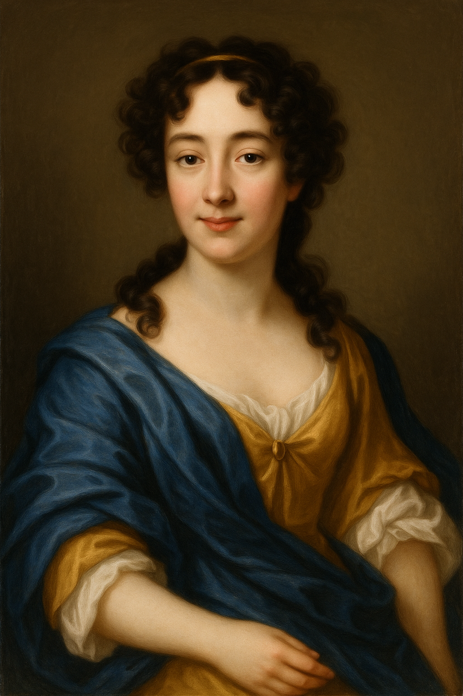

# Barbara Strozzi  (1619~1677)
**The Venetian Composer and Singer**

Barbara Strozzi was one of the most prominent female composers ofthe Baroque era. In a society where women's musical activities were heavily restricted, she was a rare figure who published eight collections of her own compositions. She is often regarded as the first female composer to build a career primarily through her own original works. Strozzi was active in Venice and grew up in an artistic environment, supported by her adoptive father, the renowned poet Giulio Strozzi, who helped connect her with leading intellectuals and artists of the time.

## List of Important Works

| Year      | Works                                  | YouTube                                     |
| --------- | -------------------------------------- | ------------------------------------------- |
| 1659      | Lagrime mie Op.7                       |[Listen](https://youtu.be/w2lBnocuMC0?feature=shared) |
| 1644      | Che si può fare Op.8                   |[Listen](https://youtu.be/1F458aC_FUM?feature=shared) |
| 1644      | II primo Libro de'Madriga1i, Op.1      |[Listen](https://youtu.be/ETxIcs-xQnw?feature=shared) |
| 1655      | O Maria (Sacri Musicali Affetti, Op.5) |[Listen](https://youtu.be/BWZoYpDLDX0?feature=shared) |
| 1659      | Diporti di Euterpe Op.7                |[Listen](https://youtube.com/playlist?list=PLj_QQHFdirsKZ-Zs-Ln9SLs_gNHqojaT5&feature=shared)|
| 1651~1655 | Cantate, ariette e duetti              |[Listen](https://youtu.be/jJKMng1jkY8?feature=shared) |

## Childhood and Early Years  
Barbara Strozzi was born in Venice in 1619. She was the adopted (and likely biological) daughter of the poet Giulio Strozzi, who recognized her musical talent early and provided her with a strong humanistic and artistic education. From a young age, she was immersed in Venice's vibrant intellectual and musical circles, receiving training under the composer Francesco Cavalli.

## Musical Career and Style  
Strozzi did not work under the patronage system typical of the time but instead published eight volumes of music under her own name—a remarkable achievement for a woman in the 17th century. Her works, mostly secular cantatas and arias, were notable for their expressive vocal writing, lyrical ornamentation, and bold harmonic shifts. Her music stands as a bridge between the Renaissance madrigal and the emerging Baroque vocal style.

## Challenges and Identity  
As a woman composer in a male-dominated society, Strozzi had to navigate societal constraints. She was rumored to be a courtesan, a claim likely stemming from prejudice against female artists who stepped into the public eye. Despite these challenges, she maintained an active musical presence through publishing and private performances.

## Masterpieces and Legacy  
Barbara Strozzi’s output includes over 125 works, predominantly for solo voice and continuo. Her compositions explore themes of love, sorrow, and passion, often drawing on poetic texts. Representative works include *Lagrime mie*, *Che si può fare*, and *Amor dormiglione*. Today, she is celebrated as one of the earliest and most prolific female composers in Western music history.

---

## Timeline of Barbara Strozzi  
| Year | Event              | Description                                |
|------|-------------------|--------------------------------------------|
| 1619 | Birth             | Born in Venice, Italy                      |
| 1635 | First Appearance  | Performed in Accademia degli Incogniti     |
| 1644 | First Publication | *Il primo libro de' madrigali*             |
| 1651 | Major Work        | Published *Cantate, ariette e duetti*      |
| 1664 | Final Publication | Eighth and last book of vocal works        |
| 1677 | Death             | Died in Padua, Italy                       |

---

## Introducing Strozzi's *Lagrime mie*

- **Published:** 1659, in *Diporti di Euterpe*  
- **Voice type:** Soprano and basso continuo  
- **Form:** Arioso–Recitative–Aria  

*Lagrime mie* (“My tears”) is one of Strozzi’s most celebrated cantatas. It begins with a highly expressive arioso line, symbolizing grief and suppressed anguish. The piece transitions through multiple emotional states using recitative and aria forms, showcasing her gift for text setting and emotional depth.

### Key Features:
- Chromatic descending lines evoke weeping and despair  
- Use of silence and harmonic tension to enhance expression  
- Text reflects the pain of forbidden or lost love  

---

## Movement Overview of *Lagrime mie*

### 1st Section – *Arioso (Largo)*  
Opens with the mournful cry "Lagrime mie," featuring descending chromatic lines and expressive harmony.

### 2nd Section – *Recitative (Moderato)*  
Develops the narrative in a free rhythmic style that follows the contours of the text.

### 3rd Section – *Aria (Allegro)*  
More agitated and rhythmically active, depicting emotional turmoil and inner struggle.

---

## Concluding the Textbook of Barbara Strozzi  
Barbara Strozzi’s life and work stand as a remarkable testament to artistic perseverance in the face of social barriers. As a woman navigating the male-dominated world of Baroque music, her legacy is not only musical but symbolic. Her compositions continue to inspire performers, musicologists, and audiences today.

### Other Notable Works
- *Che si può fare*  
- *Amor dormiglione*  
- *Il primo libro de’ madrigali*  
- *Sacri musicali affetti* (1655)

---

## Guides for Further Studies  
Many historically informed performances of Strozzi's works are available online. Notable recordings by soprano Emma Kirkby and ensembles like L’Arpeggiata provide valuable insights. Listening to these performances
