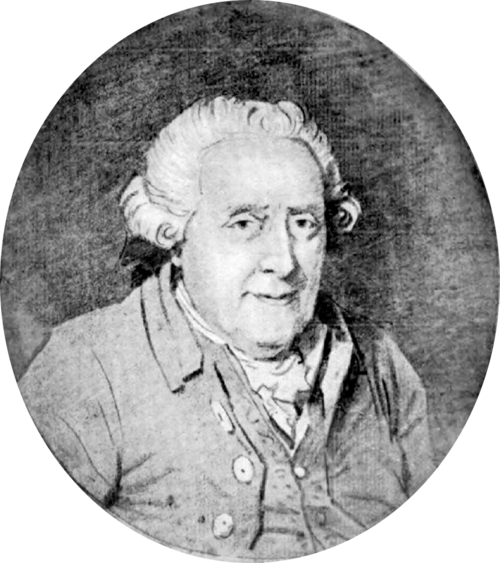
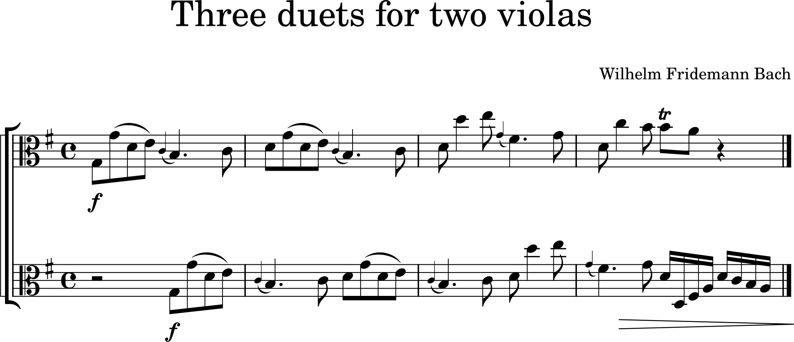
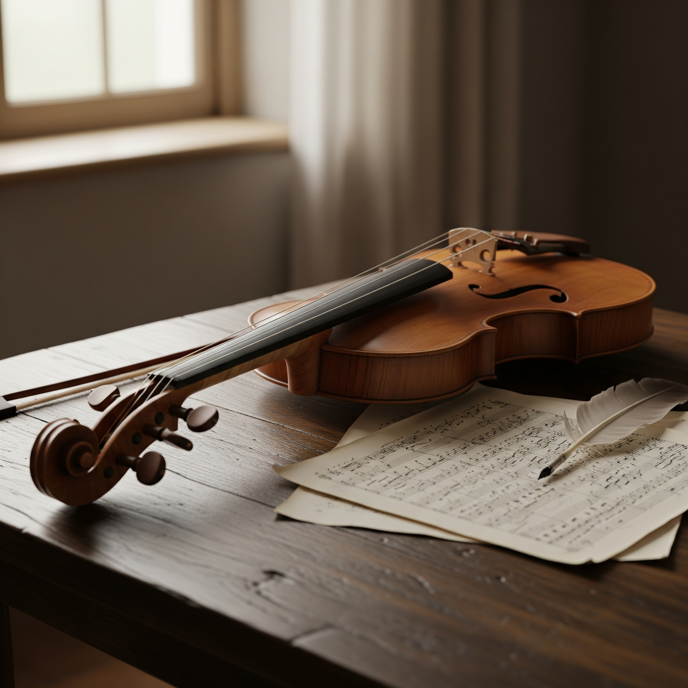

# Wilhelm Friedemann Bach(1710-1784)
---

[^1] [^2]

[^1]: Credit : Portrait of Wilhelm Fridemann Bach by Dr. Martin Falck-Leipzig, 1782, Public Domain, [Wikimedia Commons](https://commons.wikimedia.org/wiki/File:Wilhelm_Friedemann_Bach_sketch.png)
[^2]: Credit : Antiochus and stratonice, Jacques-Louis David, 1774, Public Domain, [Wikimedia Commons](https://en.wikipedia.org/wiki/File:Jacques-Louis_David_-_Antiochus_and_Stratonica_-_WGA06042.jpg)
**Wilhelm Fridemann Bach(1710-1784)** is a German composer. He is one of the many members of the Bach family. Despite having abundant talent, he has received relatively little attention. He is a person who has been re-examined after a while. Nevertheless, he has not yet been well-known. W.F. Bach lived during a pivotal and dynamic period in European, particularly German, music history. 

Have you ever listened to ‘Klavierbüchlein fur Wilhelm Friedemann Bach of keyboard pieces?
[📺](https://www.youtube.com/watch?v=f-cKJXqJGGg) 
This adorable piece was written by J.S. Bach for his 10-year-old first son. Wilhelm Friedemann Bach was the first son born to **J.S. Bach** and Maria Barbara Bach in 1710.
Like [Domenico Scarlatti](scarlatti_domenico_keyboard_sonata_k80.md), son of Alessandro Scarlatti, Wilhelm Friedemann Bach was born into a great family of musicians.

W.F. Bach, a composer from the Baroque period, began to receive music education from his father. He entered the University of Leipzig in 1729. Showing musical talent, he was appointed organist of the Church of Saint Sophia in Dresden in 1733. In 1746, he moved to Halle. After his father's death in 1740, he faced many difficulties. He married late in 1751, and in 1762, he was appointed to the court of Darmstadt, but he declined. In 1764, he resigned his position in Halle, and in 1774, he moved to Berlin to continue his independent music career.The chronic alcoholism that followed his father's death made it difficult for him to the end, and he died in Berlin in 1784.

Despite his undeniable genius, his struggle to find a consistent place in this changing musical world has become relatively ambiguous compared to other family members. However, in essence, Wilhelm Friedemann Bach was a composer of immense talent who was deeply rooted in his father's Baroque tradition and composed throughout a period of profound stylistic upheaval. His life went through the rise and fall of the late Baroque and Classical periods. His music often reflects this tension and combines new expressive sensibilities with strict counterpoints. 

## Table of Contents

- [A timeline of His life](#a-timeline-of-his-life)
- [List of important works](#list-of-important-works)
- [Score of three duets for two violas](#score-of-three-duets-for-two-violas)
- [Listening Guide](#listening-guide)
- [Key Features of three duets for two violas](#key-features-of-three-duets-for-two-violas)
---

## A Timeline of his life

| Year | Contents | 
| ---- | ----- |
| c. 1710 | Born in Weimar, the first son born to **J.S. Bach** and Maria Barbara Bach in 1710. |
| c. 1729 | Matriculated at Leipzig University, He studied law, philosophy, and mathematics |
| c. 1733 | Appointed organist to the Church of St. Sophia in Dresden |
| c. 1746 | Moved to the Liebfrauenkirche at Halle |
| c. 1750 | Death of his father, J.S.Bach |
| c. 1751 | Married with Dorothea Elisabeth Georgi |
| c. 1764 | Resigned his post in Halle as his dissatisfaction grew |
| c. 1784 | Died in Berlin |

[Back to TOC](#table-of-contents)

## List of important works

| Year | Works | YouTube |
| ---- | ----- | ------- |
| unknown  | Trio sonata in C major | [listen](https://www.youtube.com/watch?v=OLBvnDDBx8Y) |
| around or after 1740 | Sinfonia in D minor | [listen](https://www.youtube.com/watch?v=WIMSczECPQI) |
| 1740 | Concerto for two Harpsichords in E flat Major | [Listen](https://www.youtube.com/watch?v=q-mZxJkj4Sk) |
| 1775 | 3 Viola Duets | [Listen](https://www.youtube.com/watch?v=6b6BgNSQx3U) |
| 1778 |  Fugue in F Minor | [Listen](https://www.youtube.com/watch?v=i7Y1na7cflg) |

[Back to TOC](#table-of-contents)

## Score of three duets for two violas

## Listening Guide

| Timing | Text |
| ------ | ------------- |
| 0:00 - 3:04 | Allegro |
| 3:04 - 6:55 | Lamento |
| 6:55 - 8:55 | Presto |
| 8:55 - 13:14 | Tempo giusto |
| 13:14 - 14:15 | Amoroso |
| 14:15 - 16:32 | Alla breve (Fuge) |
| 16:32 - 19:30 | Allegro di molto  |
| 19:30 - 20:20 | Scherzo  |
| 20:20 - end | Vivace  |

[Back to TOC](#table-of-contents)

## Key Features of three duets for two violas

- Baroque Counterpoint: A prominent characteristic is the complex contrapuntal texture, where the two viola parts engage in an equal dialogue. This includes fugato-like imitation and canonic progressions, emphasizing the interaction of equal voices rather than a melody-accompaniment relationship.
- Early Classical Elements: Moving away from strict Baroque forms, these duets of viola[^3] show attempts at Classical thematic development and contrast. While not full-fledged sonata forms, the principles of exposition-development-recapitulation may appear in parts, or melodic ideas might be presented and varied independently.
- Varied Movement Tempi and Characters: Each duet typically consists of three or four movements, with differing tempi (e.g., Adagio, Allegro) and musical characters. This sometimes resembles the structure of Baroque church sonatas or trio sonatas.

 [^4]
 
 [Back to TOC](#table-of-contents)
 
[^3]: In the Baroque era (roughly 1600-1750), the viola solidified its place as a crucial instrument in orchestral and chamber music. Initially coexisting with viols, the viola da braccio (ancestor of the modern viola) gradually gained prominence due to its more powerful sound. It primarily served to fill out harmonies and add depth, bridging the sound between violins and cellos. While often in a supporting role, the viola's integral contribution to the era's polyphonic music established its essential role in string ensembles.
[^4]: Credit : An image of viola created by Gemini 2.5pro, June 10. 2025, 00:30am
