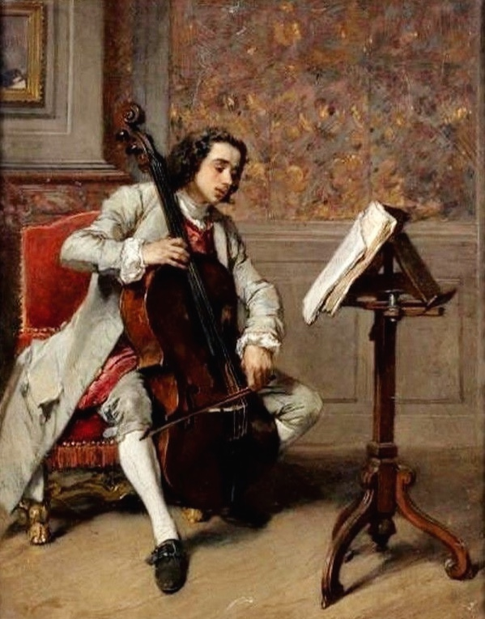
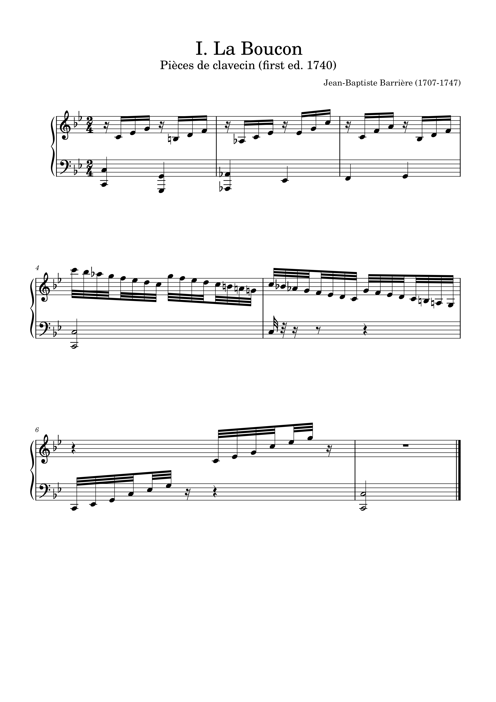

# Jean Baptiste Barrière (1707 – 1747)

Jean-Baptiste Barrière is a French Cellist and also Composer, was a significant composer of the 18th century, contributing to the development of cello music. His works are technically sophisticated and emotionally rich, making them an important part of the repertoire for contemporary cellists. Barrière explored the depths of musical expression while continuing the traditions of Baroque music and developing his unique style. His music reflects the social and cultural currents of his time, and it continues to inspire and resonate with audiences today. 

 

 
## List of Important Works

| Year | Works | YouTube |
| 1740 | Sonata for Duet in G Major | [Listen](https://www.youtube.com/watch?v=J3sWlZC84dw)|
| 1740 | Pieces de clavecin | [Listen](https://www.youtube.com/watch?v=opqHeUnfJKM) |
| ---- | ----- | ------- |
| ---- | ----- | ------- |
| ---- | ----- | ------- |

. Key Works:
   - 6 Cello Sonatas (Sonates pour violoncelle)
   - Various chamber music pieces
   - Ballades and other instrumental works

   ( #JeanBaptisteBarrière Tis #France
#Cello #playerand #composer. He was born in 1707.
#Born in #Bordeaux in 1747 at the age of 40
He died in Paris at an early age.
He studied #viol early and played viol sonata
published a collection of (viol sonatas) in France.
It gained great popularity through viol music,
At that time, there was also an altalian #taste in France #As it becomes more dominant, #cello is replacing #viol
It was time. In France, instead of the viol
The cello became popular and #completely
#When #the #position of #the #violin #was #replaced, he too
Naturally, I became a #skilled #cellist .
In fact, in Italy this process
It happened 40 years before France. He The most widely known cello of his time
He was one of the performers. In 1731 he
Went to Paris and studied at the Royal Conservatory of Music (Academie Royale de Musique) and Opera
Joined the theater as a performer and earned 445 livres
He was paid a salary of (livres) in 1733.
In October, he composed a number of sonatas and
The King for his services in publishing instrumental works.
Louis XV gave him Fontainebleau
Special benefits at the Palace of Fontainebleau awarded to his best-known disciples
One of them is the lord of Trusili
(Seigneur of Trousily) of Gergore
Count of Guergorlay. 1733.
His first published collection of works, Sonates for cello and basso continuo> 7H
was a success, and in 1740 his A second edition was published.
His second collection of works was published around 1735.
It has been published.
He went to Italy in 1736.
Vienna (Wine) from 1726 to 1739
He was employed as a cellist at the court.
A renowned cello player from Italy.
#FrancescoAlborea (#FrancescoAlborea,
(1691-1739) learned cello from. After that He stayed in Italy and traveled until 1737.
He returned to Paris again in the summer of 1738.
Conseil Spirituel, August-September 1738
His appearance at (Concert Spirituel)
The performance left a very strong impression on the audience at the time.
The local press at the time left behind
(Local press) reported that in 1739
Over the next 12 years at Versailles
A new and valid privilege was granted to him, n January 1740, the new privilege was officially recognized.
It was done. He did it before 1740.
He published three volumes of his works in succession.
A collection featuring another pair of works
It was published the following year. But unfortunately,
He was at the peak of his creativity.
He died young at the age of 40.

Today his name is popularly known as
Although not famous, a few years after his death Pierre-Louis D'Aquin of Chateau-Lyon (Pierre-Louis Daquin, 1720-1796) said, "Recently
The late famous composer Barriere
A few people have everything that humans want.
As mentioned, "I was one of the people"
He was very famous in the Paris music scene at the time.
He was a person. His works have the characteristics of a work.
Excellent and outstanding compositional sense (sensitivity)
and fine tonality) and emotional resonance
(emotional resonance) and deep resonance
He is famous for his sonority. Some of his works are
Frequent and complex bowing techniques techniques) and fingerings
accompanying or equal to the right and left hands
Very high coordination is assumed
A technical performance of the level
It was a demand for performance.
Some of his works are even more enjoyable to perform.
Much subtlety and skillful mastery
It required virtuosity.
He added Italian style to this
(Italian style) elements as his own
Not only did he study, but he also developed his own music Musical discourse and subtlety
(subtlety) Rich French taste
(French flavour) added.
