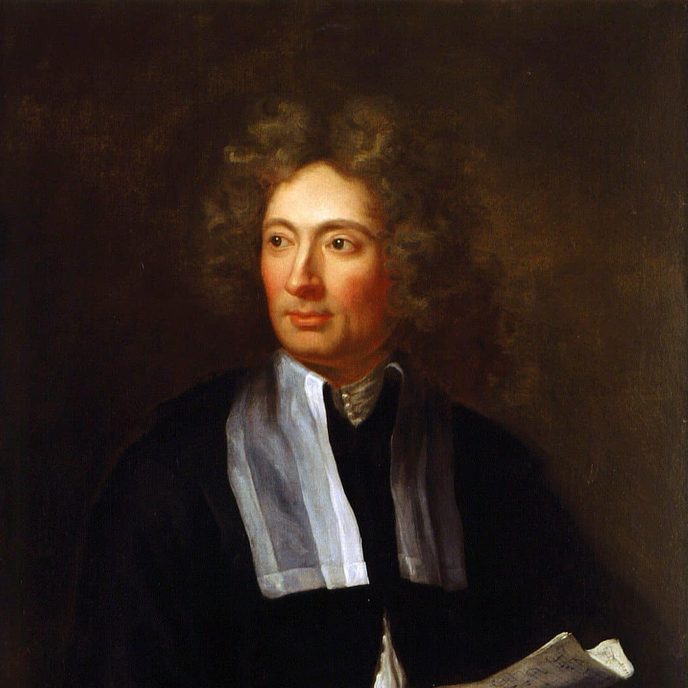

**Arcangelo Corelli** was a **pivotal figure** in the transition from early to high Baroque music. As both a composer and violinist, he played a **foundational role in shaping instrumental music**, laying the groundwork for future giants such as **Handel**, **Vivaldi**, and **J.S. Bach**.

---

## Learning Objectives

By the end of this guide, learners will be able to:

- Identify Corelli’s contributions to Baroque music and violin technique.  
- Recognize key features of the **sonata da chiesa** and **concerto grosso** forms.  
- Analyze Corelli’s stylistic traits using **La Folia** as a case study.  
- Situate Corelli within the broader **Historical Context** of 17th-century Italy.

---

## Historical Context

### The Baroque Period (c. 1600–1750)

- Marked by **contrast**, **ornamentation**, and **expressive intensity**.  
- Rise of **tonal harmony** and **instrumental music**.  
- Corelli exemplified and refined these characteristics.  
- See also: **Sonata da chiesa** & **Sonata da camera**.

### Italy as a Musical Powerhouse

- Rome was a hub for **Baroque innovation**.  
- Supported by patrons such as **Queen Christina of Sweden** and **Cardinal Pietro Ottoboni**.  
- Corelli’s music flourished within this **artistically rich environment**.

### Rise of Instrumental Genres

- Corelli broke from vocal dominance by writing **instrumental-only** music.  
- Helped establish:  
  - **Trio sonata**  
  - **Solo sonata**  
  - **Concerto grosso**

---

## Corelli’s Contributions

### Form and Style

- Clarity, **balanced phrasing**, and **functional tonality**.  
- Codified [**sonata da chiesa** (church sonata) and **sonata da camera** (chamber sonata) forms.

### Violin Technique

- As a violinist, he elevated the **technical and expressive** possibilities of the instrument.  
- Inspired composers and served as a **model for violin pedagogy**.

### Pedagogical Legacy

- Taught influential students like **Francesco Geminiani**.  
- Influenced contemporaries including **Handel**, **Vivaldi**, **J.S. Bach**, and [Heinrich Schütz](purcell_rondeau.md).

---

## List of Important Works

| Year | Work                                                      | YouTube Link                                                                 |
|------|-----------------------------------------------------------|-------------------------------------------------------------------------------|
| 1714 | **Concerto grosso g‑Moll, Op.6 No.8** (“Christmas Concerto”) | [▶ Listen](https://youtu.be/e68h3Qwm2OA?si=dFQh-q0p_usD4cYR)                   |
| 1714 | **Concerto grosso, Op.6 No.4**                            | [▶ Listen](https://youtu.be/3smZkpqXYHs?si=2jMfp9sKRogMjwbY)                   |
| 1689 | **Trio Sonata in D major, Op.3 No.2**                     | [▶ Listen](https://youtu.be/CwJRzYv6HNI?si=nBs1Is2bhpD5a67c)                   |
| 1700 | **Violin Sonata in D minor “La Folia,” Op.5 No.12**       | [▶ Listen](https://youtu.be/VBJxHUTzcs0?si=p4RnCYt4wvjH8XgP)                   |
| 1714 | **Concerto grosso in D major, Op.6 No.1**                 | [▶ Listen](https://youtu.be/7aG8FOnAJE4?si=VCW_2MgmdjMIDkY-)                   |

---

## Listening Guide: *La Folia*, Op.5 No.12

- **Form**: Theme and variations  
- **Mood**: Dramatic and expressive with dance‑like energy  
- **Instrumentation**: Solo violin with continuo  

**Features to Listen For**:

- Repeated **bass pattern** anchoring the piece  
- Increasing **technical demands** and variation intensity  
- Rich **ornamentation** and violinistic flair

---

## Instruments of the Period

### Baroque Violin  
- Gut strings and lighter bow enabled nuanced articulation.

   
*Baroque violin and bow*

### Harpsichord  
- Provided harmonic foundation as part of the continuo.

### Violone / Cello  
- Offered bass line support in trio sonatas and concerti.

---

## Composer Timeline

| Year | Event                                                    |
|------|----------------------------------------------------------|
| 1653 | Born in Fusignano, Italy                                 |
| 1670s| Studied in Bologna and joined Accademia Filarmonica      |
| 1675 | Moved to Rome and began working for Queen Christina      |
| 1681 | Published Op.1: Trio Sonatas                             |
| 1700 | Published **La Folia**, Op.5 No.12                       |
| 1713 | Died in Rome; buried in the Pantheon                     |
| 1714 | Published **12 Concerti Grossi**, Op.6                   |

---

## Legacy

- Corelli is remembered as the **“father of the concerto grosso.”**  
- His works became a **foundation of violin education**.  
- Inspired later tributes such as **Rachmaninoff’s “Variations on a Theme of Corelli, Op.42.”**

> “Corelli’s music speaks with elegance, grace, and depth — a timeless voice of the Baroque.”

---

## Related Composers

- **Handel**  
- **Vivaldi**  
- **J.S. Bach**  

---

## Related Compositions

- **La Folia**, Op.5 No.12  
- **Christmas Concerto**, Op.6 No.8  

---

## Related Terms

- **Sonata da chiesa**  
- **Sonata da camera**  
- **Concerto grosso**  
