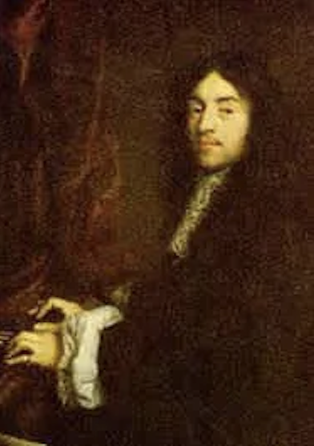
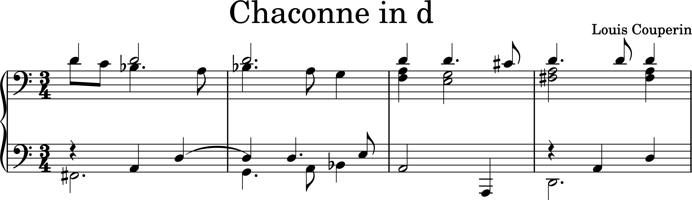
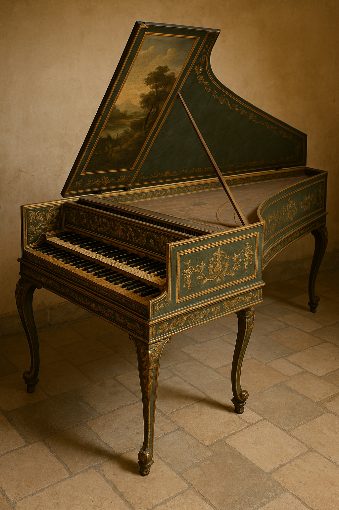

# Louis Couperin (1626-1661)

[^1] [^2]

[^1]: Credit: A portrait of Louis Couperin by ChatGPT, Jun 8, 2025, 14:43:56 PM, with the prompt "Create an image of Louis Couperin (1626-1661)."
[^2]: Credit: *A Dance to the Music of Time* by Nicolas Poussin, 1634, Public Domain, [Wikimedia Commons](https://commons.wikimedia.org/wiki/File:The_dance_to_the_music_of_time_c._1640.jpg) It's a contemporary work of art with Louis Couperin. Baroque artists, like Couperin and Poussin, valued order, balance, and harmony, stemming from classical ideals evident in structured compositions and precise musical counterpoint. Their art aimed to evoke specific emotions (affects) and persuade, using visual and musical rhetoric. A distinctive elegance and refinement characterized the French Baroque, seen in delicate ornamentation and idealized figures. Finally, the pervasive influence of dance shaped both music and painting, imbuing works with rhythmic flow and graceful movement.

**Louis Couperin** (1626–1661) was a highly influential **French Baroque** composer, harpsichordist, and organist. Emerging as a leading musical talent in Paris during the mid-17th century, he quickly secured a prominent reputation as a virtuosic performer on the harpsichord and organ, as well as a skilled viol player. His promising career, however, was tragically curtailed by his premature death at the age of thirty-five.

Louis Couperin made significant and lasting contributions to the evolution of both French organ and harpsichord music. He played a key role in developing the French organ school, with compositions that included specific instructions for registration (the selection of organ stops), a novel practice at the time. Perhaps his most celebrated innovation was the development of the **unmeasured prelude** for the harpsichord. This unique genre, characterized by a distinctive, free-flowing notational style, allowed for expressive and improvisatory performances.

Although his life was short, Louis Couperin's musical legacy, particularly his harpsichord pieces distinguished by their sophisticated ornamentation and inventive harmonies, has endured. His organ music is recognized as a crucial link in the transition from strict, contrapuntal writing to a richer, more concertante style, thereby influencing later Baroque composers. While none of his compositions were published during his lifetime, a substantial collection of his works has been preserved through manuscripts, solidifying his esteemed position as one of the foremost French keyboard composers of the 17th century. He is often compared to his Italian contemporary, [Girolamo Frescobaldi](frescobaldi_gagliarda.md), for the significant advancements he brought to keyboard music in France.

## Table of Contents

- [A Timeline of His Life](#a-timeline-of-his-life)
- [List of Important Works](#list-of-important-works)
- [Excerpt of Chaconne in d](#excerpt-of-chaconne-in-d)
- [Listening Guide](#listening-guide)
- [Key Features of Chaconne in d](#key-features-of-chaconne-in-d)
  
## A Timeline of His Life

| Year | Contents |
| ---- | -------- |
| c. 1626 | Born in Chaumes-en-Brie, France. He was the eldest of the three musical Couperin brothers (François and Charles were younger). |
| Before 1650 | Likely received his early musical training from his father, Charles Couperin (the elder), who was the organist of the local parish church in Chaumes-en-Brie. |
| c. 1650-1651 | Moved to Paris. This move was famously facilitated by a chance encounter with Jacques Champion de Chambonnières, the most renowned harpsichordist of the time. According to tradition, Couperin and his brothers performed for Chambonnières on the feast day of Saint James (July 25) at the Château de Brie, impressing him greatly. |
| 1652 | Appointed organist at the church of Saint-Gervais in Paris. This prestigious position was held by the Couperin family for over 170 years after him. |
| c. 1653 | Entered the service of the French court, possibly as a chamber musician, though his exact official title is debated. He was highly regarded by King Louis XIV. |
| c. 1655-1657 | Composed a significant body of his surviving harpsichord music, much of which is found in the "Bauyn Manuscript." This period likely saw the creation of many of his unmeasured preludes, dances, and his famous chaconnes. |
| 1656 | Composed "Fantaisie sur l'orgue de St. Gervais" (Fantasy on the organ of St. Gervais), one of his few dated compositions, indicating his active role as an organist. |
| 1657 | Accepted an offer to become the harpsichord teacher to the young Dauphin (future Louis XV), though he refused to become a full court musician, reportedly out of loyalty to Chambonnières, who held a similar position.|
| c. 1659-1660 | Composed various pieces for viol, showcasing his versatility beyond keyboard instruments. |
| 1661 | Died in Paris, aged around 35. His death was premature and prevented him from further developing his highly influential style. He was succeeded as organist at Saint-Gervais by his younger brother, Charles Couperin.|

[Back to TOC](#table-of-contents)

## List of Important Works

| Year | Works | Youtube |
| ---- | ----- | ------- |
| unknown[^3] | Unmeasured Prelude in F | [Listen](https://youtu.be/lqvm0k2VUtU?si=zBvDbLtF-WDMTAjh) |
| unknown | Unmeasured Prelude in D | [Listen](https://youtu.be/3-xTvfr3nJ8?si=tKl2Z85yXPxwDYTY) |
| unknown | Five pieces for organ in d | [Listen](https://youtu.be/MvhcK2TLTPM?si=xTvVZUVhTOb9v-DH) |
| unknown | Passacaille in C | [Listen](https://youtu.be/MYH8Vfqk_VU?si=Y6L3nGmD5cqxXXmT) |

[^3]: The "Year Unknown" for the listed works is typical, as most of his music survives in posthumous manuscript collections without precise composition dates. The provided YouTube links are examples of performances of these types of works.

## Excerpt of Chaconne in d

[Listen to Chaconne in d](https://youtu.be/yEF1snITUhs?si=8Z_xtWHMepfMPPaO)

## Listening Guide

| Timing | Text and Form |
| ------ | ------------- |
| 0:00 - 0:15 | Refrain[^4] |
| 0:15 - 0:29 | First Couplet[^5] |
| 0:29 - 0:43 | Refrain |
| 0:43 - 0:58 | Second Couplet |
| 0:58 - 1:12 | Refrain |
| 1:12 - 1:41 | Third Couplet |
| 1:41 - 1:55 | Refrain |
| 1:55 - 2:13 | Fourth Couplet |
| 2:13 - End | Refrain |

[Back to TOC](#table-of-contents)

[^4]: In chaconne form, particularly in the French Baroque style, a Refrain refers to the continuously repeating bass line or chord progression (the ostinato) that forms the structural backbone of the piece. The 4-measure excerpt repeats twice, making the total 8 measures, which serves as the refrain of this piece.
[^5]: Couplets are the contrasting variations or episodes that appear between repetitions of this Refrain. They introduce melodic, rhythmic, or harmonic changes, offering diversity and developing the musical ideas while remaining rooted in the underlying bass pattern.

## Key Features of Chaconne in d

- Archetype of the Chaconne[^6] Form: This piece exemplifies the typical chaconne structure, showcasing diverse variations built upon a repeating bass line (ostinato bass).
- French Baroque Characteristics: While Italian chaconnes often emphasize flashy, improvisatory elements, Couperin's chaconne highlights the unique aesthetics of French Baroque. It features restrained elegance, delicate ornamentation, and profound emotional expression.
- Harpsichord[^7] Repertoire: Composed primarily for the harpsichord, this piece contributed to exploring the instrument's varied timbres and expressive potential during that era.
  
  [^8]

[Back to TOC](#table-of-contents)

[^6]: A chaconne is a Baroque musical form originating from a slow, triple-meter dance. Its core feature is a repeating short bass line (ostinato bass) over which various variations are built. While initially a lively 16th-century dance, it evolved into a majestic instrumental piece in the 17th century, known for its solemn atmosphere and intricate variations within its consistent 3-beat framework.
[^7]: The harpsichord is a keyboard instrument popular from the Renaissance to the Baroque era. Unlike a piano, which uses hammers, the harpsichord produces sound when a plectrum plucks the strings. This mechanism meant volume control was difficult, but it created a clear, metallic, and distinctive timbre. It played a crucial role in Baroque music and is still used today for period performances.
[^8]: Credit: An image of harpsichord by ChatGPT, Jun 8, 2025, 14:22:41 PM, with the prompt "Create an image of harpsichord used during the period of Louis Couperin (1626-1661)."
