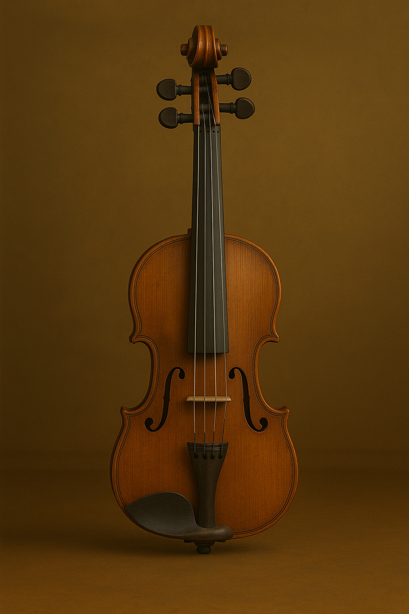

# Elisabeth Jacquet De La Guerre (1665-1729)

Credit: Portrait of Elisabeth Jacquet De La Guerre by François de Troy  

[Wikipedia](https://en.wikipedia.org/wiki/%C3%89lisabeth_Jacquet_de_La_Guerre)

***
## Table of contents
- [Timeline](https://github.com/lsb0306/openmusichistory/blob/main/de_la_guerre_violin_soanatas.md?plain=1#L11)  
- [Who is Elisabeth Jacquet De La Guerre?](https://github.com/lsb0306/openmusichistory/blob/main/de_la_guerre_violin_soanatas.md?plain=1#L24)  
- [6 violin sonatas](https://github.com/lsb0306/openmusichistory/blob/main/de_la_guerre_violin_soanatas.md?plain=1#L43)   
- [What is a violin?](https://github.com/lsb0306/openmusichistory/blob/main/de_la_guerre_violin_soanatas.md?plain=1#L95)  
- [Listening Guide](https://github.com/lsb0306/openmusichistory/blob/main/de_la_guerre_violin_soanatas.md?plain=1#L)  
- [Question for review](https://github.com/lsb0306/openmusichistory/blob/main/de_la_guerre_violin_soanatas.md?plain=1#L)  
- [Guides for further studies](https://github.com/lsb0306/openmusichistory/blob/main/de_la_guerre_violin_soanatas.md?plain=1#L)  
***

  ## Timeline  
| Year | Event/Activity |  Youtube |
| ---- | -------------- |------------------------------------------------ |
| 1665 | 	Born in Paris into a family of musicians. |
| 1670 | 	Gained fame as a child prodigy harpsichordist at the court of Louis XIV. |
| 1684 | 	Married Marin de La Guerre. Adopted the name **Jacquet de La Guerre**. |
| 1687 | 	Published her **first collection of harpsichord suites** (Pièces de clavecin) | [Listen🔈](https://youtu.be/c9kJj0DnEGw?si=wRQ_OoFlZZJE8mPZ) |
| 1694 | 	Premiered the opera **Céphale et Procris**—a rare example of an opera by a French woman composer. | [Listen🔈](https://youtu.be/HZDqqI0_dxo?si=aQve0TJq-Jo1iwM6) |
| 1707 |	Published **sonatas for violin and harpsichord** | [Listen🔈](https://youtu.be/IUlW1Uj7G5E?si=AkYUVasKfqH5uP0S) |
| 1711-1715 | Released a series of **sacred cantatas** (Cantates spirituelles) | [Watch📺](https://youtu.be/A1-RhwSfcwc?si=VY9NMAcB9mn_bnIK) |
| 1729 | Died in Paris. |  
  

## Who is Elisabeth Jacquet De La Guerre?  

**Élisabeth Jacquet de La Guerre**(1665–1729) was a prominent French composer and harpsichordist of the Baroque era, particularly known for her work during the reign of Louis XIV. Recognized from an early age as a virtuoso performer, she was especially noted for her remarkable skill in harpsichord improvisation. As a composer, she was highly versatile, engaging with a wide range of genres that reflected the tastes and trends of late 17th- and early 18th-century France.

In the late 17th century, Jacquet de La Guerre contributed significantly to the development of **French harpsichord music**.
And she was especially known for composing **opera**, a field that had very few female composers in her era.
Despite the underwhelming reception of her opera *Céphale et Procris*, she did not cease composing. Instead, she continued to publish her works and steadily established her position in the musical world.  

In the early 18th century, she also began to incorporate elements of the **Italian style**, reflecting the growing influence of composers such as [Arcangelo Corelli](A.Corelli.md)(1653-1713).
This stylistic fusion positioned her at the forefront of a broader cultural movement in France that sought to reconcile French and Italian musical aesthetics.  

  
Credit: An image of De La Guerre performing at the royal court created bt ChatGPT, Jun 1, 2025, 10:08:23 PM, with the prompt "draw a scene of Élisabeth Jacquet de La Guerre playing the harpsichord in a French salon during the reign of Louis XIV."

***
  
# 6 Violin Sonatas  
She published **six violin sonatas** in 1797, just three years after the appearance of the "Sonata" publication in France. These were released as a set, with the second book of harpsichord pieces included in the first half of the collection. The first half of the work is titled "Pieces for harpsichord that can be played on the violin" (Pièces de clavecin qui peuvent se jouer sur le viollon), while the latter half is titled "Sonatas for violin and for harpsichord" (Sonates pour le viollon et pour le clavecin). In his book Baroque Music, John Walter Hill suggested that the title of the first half implies "a single melodic line in the upper staff can be played by the **violin** (either doubling the harpsichord or as a solo), while the lower parts can be played on the **keyboard**."  

At the turn of the 18th century, Italian instrumental music—particularly the sonata form—was gaining popularity in France, a nation traditionally focused on vocal and dance-based forms. Jacquet de La Guerre’s violin sonatas reflect this cultural shift. While the precise dates of composition are uncertain, the fact that composer and theorist Sébastien de Brossard copied some of her works as early as 1695 indicates their circulation and relevance by that time.  

## Sonata No. 1  

Sonata No. 1 consists of a total of 439 measures, making it the longest of the six sonatas published in 1707. It is composed of six movements, all of which begin with an anacrusis.  
소나타 1번은 총 439마디로 되어있으며 1707년에 출판된 6개의 소나타 중 가장 긴 작품이다. 악장은 총 6개로 구성되며 전 악장이 못갖춘 마디로 시작한다.  
| Movement | Tempo | Key | Time Signature | Form |
| -------- | ----- | --- | -------------- | ---- |
| 1st. | x | dm | 3/2 | Part I: A(a+a')B(b+c)A'(a"+d)   Part II: C(e+e')D(f+g)E(h+i+i') |
| 2nd. | Presto | dm | 4/4 | Part I: A(a+a')B(b+c)   Part II: C(d+d'+e)D(f+e')E |
| 3rd. | Adagio -Presto -Adagio | dm | 2/2-6/8-2/2 | Part A: a+a'   Part B: b+b' Part C   Coda |
| 4th. | Presto | DM | 2/2 | Part A: a+b   Part B: c+d Part B': c'+d'+c"   Part C: a'+e   Part D: f+c' Part D': f'+f" |
| 5th. | Aria | dm | 3/4 | Part I: A(a+b)A'(a+b')B(a'+b") A' C A'   Part II: D E D' F |
| 6th. | Presto | dm | 4/4 | Part A   Part B   Coda |

## Sonata No. 2  
| Movement | Tempo | Key | Time Signature | Form |
| -------- | ----- | --- | -------------- | ---- |
| 1st. | Presto | DM | 2/2 | Part A:a+a'   Part B: b+c+c'   Part C: d+e   Coda |
| 2nd. | Adagio | dm | 3/2 |  단일 악절 |
| 3rd. | Presto | DM | 6/4 |PartI: A(a+b) A'(a'+b')   PartII: c+d+d'+e   PartI': A"(a"+b"+b"')  Coda |
| 4th. | Presto | DM | 4/4 | Part A: a+a'   Part B  Part C |

## Sonata No. 3  
| Movement | Tempo | Key | Time Signature | Form |
| -------- | ----- | --- | -------------- | ---- |
| 1st. | x | FM | 2/2 | Part A: a+b  Part B: c+d |
| 2nd. | Presto-Adagio | FM | 4/4 |Part A: a+a'  Part B  Part A  Coda |
| 3rd. | Presto | FM | 6/4 | Part A  Part B  Part B'  Coda |
| 4th. | Aria | FM | 2/2 | PartI: A(a+b)+A'(a+c)  Part II: B(d+e)+C(f+g)  Part III: A(a+g')+A"(a'+g") |
| 5th. | Adagio | FM | 3/2 | Part A: a+b  Part B: c+c' |

## Sonata No. 4  
| Movement | Tempo | Key | Time Signature | Form |
| -------- | ----- | --- | -------------- | ---- |
| 1st. | x-Presto-Adagio | GM | 2/2 | Part A: a+b  Part B  Part C |
| 2nd. | Presto | GM | 6/8 | Part I: A(a+b) A'(a'+c)  Part II: B(d+d')+C(e+d")  Part III: e'+e"+e"'  Coda |
| 3rd. | Presto-Adagio | GM | 4/4 | PartI: A(a+b) A'(a'+c)  PartII: B(d+e+f)  PartIII: C(g+h)+C(g+h)   Coda |
| 4th. | Aria | gm | 6/4 | Part A: a+b  Part A': a'+c+c'  Part A: a+b  Part B: d+e+d'  Part C: f+f'+e'+b' |

## Sonata No. 5  
| Movement | Tempo | Key | Time Signature | Form |
| -------- | ----- | --- | -------------- | ---- |
| 1st. | x | am | 4/4 | Part A: a+b   Part B: c+d |
| 2nd. | Presto | am | 4/4 |PartI: A(a+b)+A'(a'+c)  Part II: B(d+a")   Part III: e+e' |
| 3rd. | Adagio[io] | AM | 3/4 | 단일 악구 |
| 4th. | Courante | AM | 3/2 | Part A: a+b   Part B: c+d   Coda |
| 5th. | Aria | am | 2/2 | PartI: A(a+a')+A'(a+a')+A(a+a')   Part II: B(b+a')   Part III: A(a+a')+C(c+a')+A(a+a')   Coda |

## Sonata No. 6  
| Movement | Tempo | Key | Time Signature | Form |
| -------- | ----- | --- | -------------- | ---- |
| 1st. | Allemande | AM | 4/4 |Part A: a+b   Part B: c+d |
| 2nd. | Presto | AM | 12/8 | Part A: a+b   Part B: b'   Part A': a'+b"  Coda |
| 3rd. | Adagio | am | 3/4 | Part I: A(a+b)B(c+d)   Part II: C(e+f)C'(e'+f')   Coda |
| 4th. | x | AM | 2/2 | 단일 악구 |
| 5th. | Aria | AM | 6/8 | Part A: a+b  Part B: c+D  Part C |
| 6th. | Adagio | AM | 3/2 | 단일 악구 |
| 7th. | Presto-Adagio | am | 2/2 | Part A: a+b   Part B: b'+c   Part B': b"+c'  Coda |
| 8th. | Aria | AM | 2/2 | Part A: a+a'   Part B: b+b'+b"   Part A: a+a'  Part C: c+c'  Part A': a+a'  Part A: a+a' |

## What is a violin? 🎻
**The violin** is a string instrument with four strings, played by drawing a bow across the strings or by plucking them with the fingers.
Among string instruments, it has the highest pitch range, and its tone is clear and delicate.  
The violin plays a central role in *orchestras*, *chamber music*, and *solo performances* across a wide range of musical genres.  
During the Baroque era, violins used gut strings and a short, lightweight bow, producing an elegant and ornamented style of performance.
In the Classical period, improvements in the instrument's structure and bow design allowed for a more refined and balanced sound.
In the Romantic era, the violin became a powerful tool for emotional expression, with virtuosic techniques gaining prominence and the instrument's musical significance greatly expanding.
In the modern era, the use of metal strings, advanced bow construction, and electronic technology has further enhanced the violin’s volume and expressive capabilities.
Today, the violin is actively used not only in classical music but also in jazz, film scores, and many other musical styles.  

## Listening Guide 
During the Baroque era, most musical pieces weren't strictly limited to the written score; performers often added improvised and free **ornamentation**. Let's listen to this piece, imagining those spontaneous embellishments. [[Back to TOC]](#table-of-contents)

## Question for review
Q1. Which national musical style did Élisabeth Jacquet de La Guerre seek to integrate with French traditions in the early 18th century?  

Q2. Which genre of Italian instrumental music was gaining prominence in France during the late 17th and early 18th centuries?  

## Guides for further studies
Élisabeth Jacquet de La Guerre was significantly influenced by **François Couperin**(1668-1733). If you would like to learn more about François Couperin — one of the most influential pioneers in the fusion of French and Italian musical styles, you can refer to this [Link](couperin_chaconne.md)  

