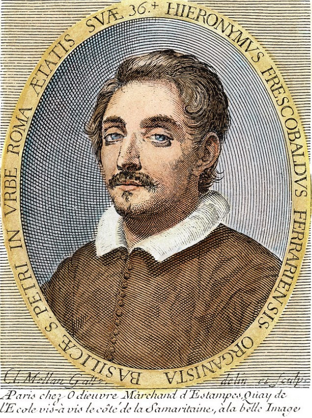

# Girolamo Frescobaldi (1583–1643)

 
Italian composer, 
I briefly studied Frescobaldi in a first-year university class. He is a l esser-known composer, but when I listened to his music, I found it incredibly captivating. What I found even more intriguing was the fact that the great composer Bach also studied and transcribed Frescobaldi's music. Since Frescobaldi contributed greatly to the development of keyboard music, I am eager to explore his life and works in more detail.
## List of Important Works

| Year | works  | Youtube |
| ---- | ------ | ------- |
| 1635 | Fiori Musical | [listen](https://youtu.be/jI8ho4w3xt0?si=LWlDmRbC4mvHHXQa) |
| 1615 | Toccate e Partite d’Intavolatura di Cimbalo | [listen](https://youtu.be/cRWLPm0KM7s?si=lP2nftznpPi8NI9k) |
| 1628 | Canzoni da Sonare | [listen](https://youtu.be/Dn5l7ljj8N4?si=ivOeW8If4QkaWZIf) |
| 1630 | Arie Musical | [listen](https://youtu.be/Dn5l7ljj8N4?si=ivOeW8If4QkaWZIf) |
| unknown | Gagliarda in G Major | [listen](https://youtu.be/06hfLezeP1E?feature=shared) |

## Frescobaldi's Music Sheet

## About Frescobaldi
Girolamo Frescobaldi (1583–1643) was a pioneer of expressive freedom in early Baroque music, known for his use of flexible tempo. Born in Ferrara, Italy, he gained fame during his lifetime and served as the organist at St. Peter’s Basilica in Rome. Rather than strictly following a fixed beat, he encouraged performers to adjust the tempo according to the emotion and flow of the music.
This approach is clearly evident in pieces like “Gagliarda in G minor,” where rhythmic variations and expressive pacing transform a traditional dance form into a deeply emotional work.

Frescobaldi’s ideas had a profound impact on later composers, especially Johann Sebastian Bach, who studied his music closely. Frescobaldi redefined the role of the performer—not as a mechanical reproducer of notes, but as an interpreter of feeling and expression.

A composer who had a musically significant connection with Frescobaldi during the same era is [Claudio Monteverdi](Claudio_Monteverdi.md
). During the important transitional period from the Renaissance to the Baroque, both played leading roles in stylistic changes in their respective fields Monteverdi in vocal music and Frescobaldi in instrumental music.

## Frescobaldi and his Work in Historical Context
His music showed how much an artist's individuality and emotions could be richly conveyed even within the strict rules of the time. As an organist, his improvisations and emotional expressions were artistic acts that went beyond mere score reproduction, instilling a new perception of the performer's role.

Frescobaldi's works are characterized by diverse rhythms and melodies, and sometimes bold harmonic progressions, offering new musical experiences through unpredictable musical ideas and a free flow. These experimental attempts provided significant inspiration to later keyboard music composers.

The early Baroque era in which he was active was a time when the subjectivity of musical expression and the importance of emotion were emphasized. Amidst the trend of moving away from the balance of the Renaissance towards more personal and dramatic expression, Frescobaldi's music reflected the artist's desire to freely express personal emotions and communicate directly with the audience.

In conclusion, Frescobaldi's life and music are important for understanding the characteristics and changes of early Baroque music. His free forms, improvisational style, and exploration of emotional expression presented a new direction for the music of that time and continued to inspire later musicians. Through his music, we can glimpse the creative spirit of early Baroque musicians who sought new musical possibilities upon the legacy of the Renaissance.

