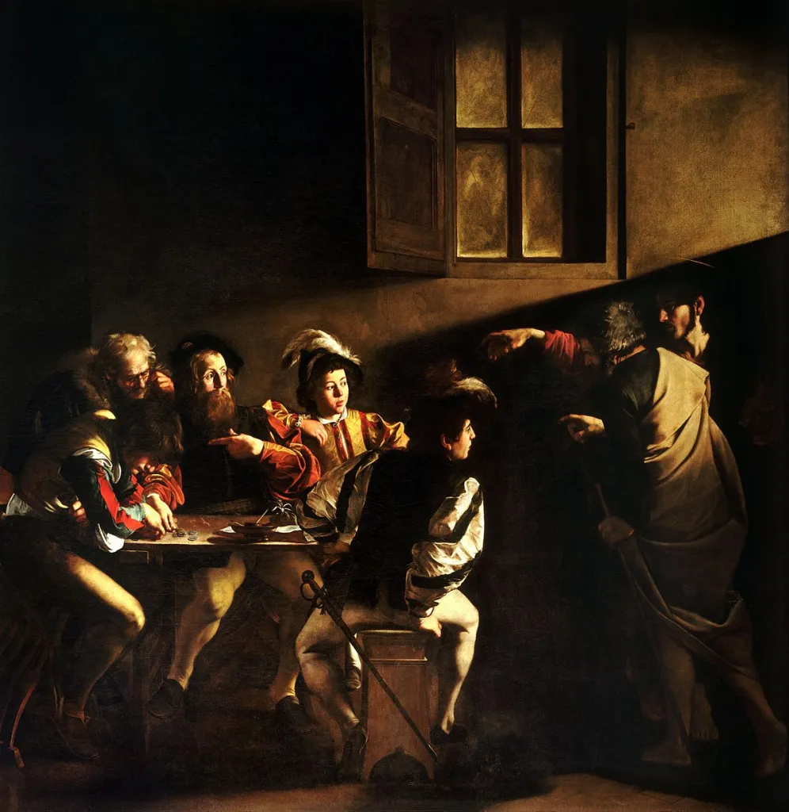

# Girolamo Frescobaldi (1583–1643)

Credit: An image of Frescobaldi created by Gemeni, Jun 9, 2025, 22:01:04, with the prompt "Create an image of Girolamo Frescobaldi (1583–1643)."

 
**Italian composer**, 
I briefly studied **Frescobaldi** in a first-year university class. He is a **lesser-known composer**, but when I listened to his music, I found it incredibly captivating. What I found even more intriguing was the fact that the **great composer Bach** also **studied and transcribed Frescobaldi's music.** Since Frescobaldi contributed greatly to the development of keyboard music, I am eager to explore his life and works in more detail.

## Table of Contents
- [Frescobaldi's Life](#frescobaldis-life)
- [List of Important Works](#list-of-important-works)
- [Listening Guide](#listening-guide)
- [Excerpt from Frescobaldi's Music](#excerpt-from-frescobaldis-music)
- [Instrument Used During This Period](#instrument-used-during-this-period)
- [About Frescobaldi](#about-frescobaldi)
- [Artworks from This Period](#artworks-from-this-period)

## Frescobaldi's Life
| Year | Key Events and Activities                              |
|-------|------------------------------------------------------|
| 1583  | Born in Ferrara, Italy                                |
| 1608  | Published first major collection of keyboard music ("Il Primo Libro delle Toccate") |
| 1610  | Began playing organ at Santa Maria Maggiore in Rome  |
| 1628  | Appointed organist at St. Peter’s Basilica in Rome   |
| 1637  | Published second major collection ("Fiori musicali") |
| 1643  | Passed away                                           |

## List of Important Works

| Year | works  | Youtube |
| ---- | ------ | ------- |
| 1635 | Fiori Musical | [listen](https://youtu.be/jI8ho4w3xt0?si=LWlDmRbC4mvHHXQa) |
| 1615 | Toccate e Partite d’Intavolatura di Cimbalo | [listen](https://youtu.be/cRWLPm0KM7s?si=lP2nftznpPi8NI9k) |
| 1628 | Canzoni da Sonare | [listen](https://youtu.be/Dn5l7ljj8N4?si=ivOeW8If4QkaWZIf) |
| 1630 | Arie Musical | [listen](https://youtu.be/Dn5l7ljj8N4?si=ivOeW8If4QkaWZIf) |
| unknown | Gagliarda in G Major | [listen](https://youtu.be/06hfLezeP1E?feature=shared) |

## Listening Guide
When listening to Frescobaldi’s music, focus on the **flexible tempo** and delicate emotional expression. His music values the flow and atmosphere more than strict formal rules, so it’s essential to notice how rhythms and harmonies change to create **tension and relaxation**. One of the appealing aspects of Frescobaldi’s music is the **contrapuntal elements**, where independent melodies interact and weave together to form rich musical conversations. Overall, the music showcases the deep emotion and expressiveness typical of the Baroque era, so pay close attention to the subtle nuances and improvisational feel in every note. [[Back to TOC]](#table-of-contents)

## Excerpt from Frescobaldi's Music

## Instrument Used During This Period

Credit: An image of harpsichord created by Gemeni, Jun 9, 2025, 21:50:04, with the prompt "Create an image of harpsichord used during the period of Girolamo Frescobaldi (1583–1643)."

## About Frescobaldi
**Girolamo Frescobaldi (1583-1643)** was a **pioneering figure of expressive freedom** in early Baroque music. He is particularly known for his use of **flexible tempo**, a significant departure from the strict musical practices of the time. Born in **Ferrara, Italy**, Frescobaldi gained fame during his lifetime and expanded his influence as the **organist at St. Peter's Basilica in Rome.**

Rather than simply adhering to the notated beat, Frescobaldi encouraged performers to .**freely adjust the tempo according to the emotion and flow of the music.**. His renowned work, .**"Gagliarda in G minor".** clearly exemplifies this approach, where varied rhythms and expressive pacing transform a traditional dance form into a deeply moving piece.

Frescobaldi's musical ideas .**profoundly impacted later composers.**, notably .**Johann Sebastian Bach.**, who closely studied his compositions. He redefined the role of the performer from a mere mechanical reproducer of notes to an .**active interpreter who conveys emotion and expression.**. This innovative approach made a crucial contribution to the .**development of Baroque music.**, particularly in enriching musical expression.

The early Baroque era, during which Frescobaldi was active, was a period that moved away from the balanced music of the Renaissance towards a pursuit of .**more dramatic and emotional expression.**. Within this historical context, Frescobaldi's .**flexible tempo.** served as a vital element in conveying musical emotions with greater subtlety. Especially in the realm of .**keyboard music.**, he pioneered new expressive territories through .**improvisation.** and experimentation with .**free forms.**. His music significantly influenced not only his Italian contemporaries but also musicians in .**Northern Europe.**, laying a crucial foundation for the development of Baroque keyboard music. Frescobaldi's .**innovative endeavors** paved the way for subsequent composers to employ a freer and more diverse musical language.[[Back to TOC]](#table-of-contents)

## Artworks from This Period

Credit: *The Calling of Saint Matthew* by Caravaggio, 1600, Public Domain, [Wikimedia Commons](https://commons.wikimedia.org/wiki/File:Caravaggio_%E2%80%94_The_Calling_of_Saint_Matthew.jpg)

[**Claudio Monteverdi**](monteverdi_lincoronazione_di_poppea.md)(1567-1643) is an important contemporary composer to consider alongside Girolamo Frescobaldi. While there is no evidence of direct interaction between the two, they share a strong musical connection through the concept of **seconda pratica**, which emphasized **expressive freedom.**. Monteverdi applied this approach to **vocal music** by prioritizing emotion and the meaning of the text, while Frescobaldi extended it to **instrumental music**—particularly keyboard works—through **free rhythm** and **bold harmonic shifts**. Each played a key role in expanding the expressive range of Baroque music, embodying the aesthetic ideals of their time in **distinct yet complementary ways**.

