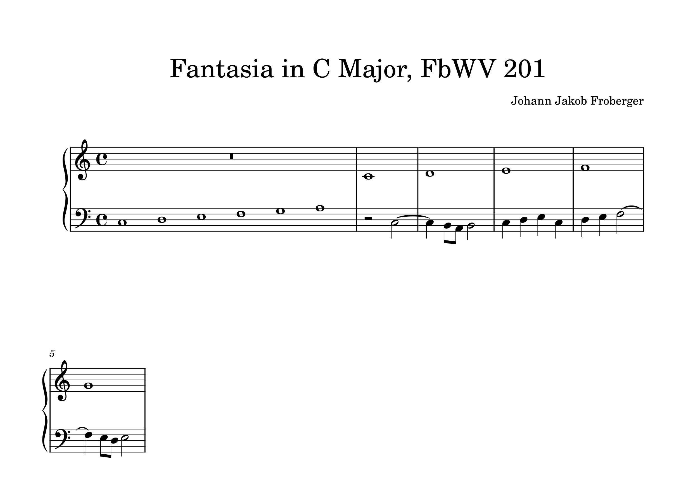
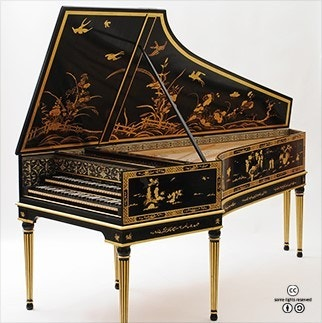

# Johann Jakob Froberger (1616-1667)

> # Johann Jakob Froberger: A Musical Bridge of the Early Baroque

> Credit: An image of Henry Purcell sourced from Naver Blog (https://blog.naver.com/zkzkshsh/221889408853)

 ### Learning Objectives
**Through this article, learners will understand that Johann Jakob Froberger played a crucial role during the early Baroque period by blending Italian, French, and German musical traditions to create distinctive keyboard works.** They will recognize how Froberger incorporated improvisatory and expressive qualities learned from Frescobaldi, French dance forms and ornamentation, as well as German contrapuntal techniques into his music. Learners will also grasp his pioneering role in systematizing keyboard suites, influencing later composers, especially Johann Sebastian Bach. Furthermore, they will appreciate the significance of emotional expression, individuality, and musical contrast in his compositions as central elements of Baroque aesthetics, and understand the lasting artistic value his music holds today.

## Table of Contents

- [Life story](#life-story)
- [List of Important works](#list-of-important-works)
- [Fantasia in C Major, FbWV 201](#fantasia-in-c-major,-fbWV-201)
- [Listening Guide](#listening-guide)
- [Why Important](#why-important)

## Life story

| Year | Location | Event |
| ---- | -------- | ----- |
| 1616 | Stuttgart, Germany | Born |
| Around 1634 | Rome, Italy | Studied under Francesco Frescobaldi |
| Around 1649 | Vienna, Austria | Began working at the Habsburg court |
| 1650–1667 | Vienna and Germany | Composed keyboard works and developed suite form |
| 1667 | Vienna, Austria | Died |

**Johann Jakob Froberger (1616–1667)** was a German composer and keyboard virtuoso of the early Baroque period. Born in Stuttgart, he traveled to Rome around 1634 to study under the renowned composer [Girolamo Frescobaldi](frescobaldi_gagliarda.md), from whom he acquired the improvisatory and expressive qualities of the Italian keyboard tradition. Over the next decade, Froberger journeyed extensively through Italy, France, and Germany, absorbing a rich array of musical styles—French dance forms, German contrapuntal techniques, and the ornamentation and drama typical of Baroque expression.

Around 1649, he entered the service of the Habsburg court in Vienna, where he continued composing until his death in 1667. Froberger played a **pioneering role in the development of the keyboard suite**, being among the first German composers to structure suites specifically for keyboard instruments. His works—including toccatas, fantasias, and dance suites—reflect a unique synthesis of European styles, characterized by contrast, emotional depth, and individual expression. His musical innovations had a lasting impact on later composers, especially Johann Sebastian Bach, and helped shape the evolution of Baroque keyboard music in Europe.
## List of Important works

| Year | works | youTube |
| ---- | ----- | ------- |
| 1649 | Toccata in C Major, FbWV 104 | [Listen](https://youtu.be/rH3MiMtTNpo?si=x_WBg2vAeZFfDOZ3) |
| 1649 | Fantasia in C Major, FbWV 201 | [Listen]( https://youtu.be/Qk912m9hCvE?si=S1ltzqt2UjOqE0HJ) |
| 1650 | Partita in A Minor, FbWV 601 | [Listen](https://youtu.be/CMbyooDgtnI?si=aDWiwy-BfmK6Q1lo) |

## Fantasia in C Major, FbWV 201

Fantasia in C Major, FbWV 201 is one of Johann Jakob Froberger’s significant early Baroque keyboard works. The piece features a free and improvisatory form, clearly expressing emotional depth and musical contrast. Froberger masterfully blends the improvisational style of Italian composer Frescobaldi, French dance rhythms and ornamentation, and the contrapuntal techniques of Germany to create a unique musical character.

This work exemplifies the balance between emotion and technique typical of Baroque music and highlights Froberger’s lasting influence on later composers, especially Johann Sebastian Bach. Fantasia in C Major played an important role in the development of keyboard music during its time and continues to be highly valued for its artistic merit today.

> **Froberger was one of the most expressive and refined composers of his time, whose keyboard works combined Italian brilliance, French elegance, and German thoroughness.** - Johann Mattheson, Der vollkommene Capellmeister (Hamburg, 1739)

[Fantasia in C Major, FbWV 201](https://youtu.be/gCyescmLEs4?si=fvcnw6JXi1CTsDbG)

### Listening Guide

| Timing | Text and Form | Description |
| :---------------- | :------------- | :----------- |
| 0:00 – 0:20 | Subject Introduction (Exposition) | Main theme is presented in one voice and imitated in others—imitative counterpoint begins. |
| 0:21 – 0:50 | Polyphonic Development | Layers of voices build as the theme is passed around; increasing harmonic tension. |
| 0:51 – 1:15 | Chromatic Passage | Chromaticism intensifies; expressive and dramatic harmonic shifts emerge. |
| 1:16 – 1:50 | Imitative Sequences | Motifs are sequenced and imitated closely; voices interweave with tighter rhythm. |
| 1:51 – 2:20 | Contrapuntal Climax | The densest and most intense part of the piece, showcasing Froberger’s complexity. |
| 2:21 – 2:50 | Textural Contrast | Moment of relief—less dense, more transparent textures offer contrast. |
| 2:51 – 3:20 | Final Section and Cadence | Clear return to tonic; cadential formulas provide a satisfying conclusion. |

**Instrumentation:**
* Harpsichord

> Credit: An image of a harpsichord sourced from Naver Blog (https://blog.naver.com/opazizi/222088062836).

## Why Important 

Froberger’s music is important because he was the first German composer to systematically blend Italian expressiveness, French elegance, and German counterpoint in keyboard music. He pioneered the keyboard suite and helped define early Baroque aesthetics of emotional depth, contrast, and individuality, laying the groundwork for later composers like J.S. Bach.

> **Rembrandt van Rijn – The Night Watch (1642), Rijksmuseum, Amsterdam**. A dynamic and dramatic group portrait that masterfully uses light and shadow to capture motion and individuality, epitomizing the Baroque emphasis on emotional intensity and realism.

Frescobaldi’s works and **Rembrandt**’s "**The Night Watch**" (1642) both embody key characteristics of **Baroque art**, such as **dramatic contrasts** and profound emotional expression. Frescobaldi’s music highlights dynamic shifts, rhythm, and improvisatory qualities, which parallel the striking chiaroscuro and energetic composition of The Night Watch. Both pieces powerfully engage their audiences, capturing the cultural spirit and artistic passion of their era.

I chose Froberger because his music uniquely blends diverse European musical traditions of the Baroque period into an **original style**. His compositions go beyond technical mastery to convey personal emotion and individuality, significantly influencing the development of Baroque music. Moreover, his works continue to resonate deeply today, holding **timeless artistic value**.

Ultimately, Froberger’s music represents the rich artistic exchanges of 17th-century Europe and demonstrates how music serves as a vital medium for expressing human emotion and creativity. Through his works, we gain insight into the historical evolution of art and appreciate how its enduring significance continues to inspire us now.

