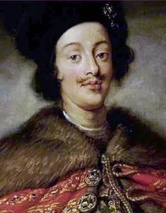

# Johann Jakob Froberger (1616-1667)

Johann Jakob Froberger (1616–1667) is a German composer. He is not as well known as J. S. Bach, but he played an important role in the development of Baroque keyboard music. Frescobaldi was his teacher, and under his guidance, Froberger absorbed the expressive and improvisatory qualities of the Italian style. He was the first among German composers to create suites specifically for keyboard instruments, and in his toccatas and fantasias for organ, he developed his own distinctive style while being influenced by Frescobaldi. Froberger’s works had a significant impact on Johann Sebastian Bach, and his compositions for keyboard are recognized as some of the richest and most captivating pieces from the early Baroque period. His emotionally expressive writing and unique musical style highlight the importance of his place in Baroque music, and he deserves greater recognition in the history of Western classical music. I chose Froberger because his music bridges Italian, French, and German traditions and laid the groundwork for later Baroque composers; his deeply personal and expressive keyboard works still resonate today, making his contribution not only historically significant but also artistically timeless.

## List of Important works

| Year | works | youTube |
| ---- | ----- | ------- |
| 1649 | Toccata in C Major, FbWV 104 | [Listen](https://youtu.be/rH3MiMtTNpo?si=x_WBg2vAeZFfDOZ3) |
| 1649 | Fantasia in C Major, FbWV 201 | [Listen]( https://youtu.be/Qk912m9hCvE?si=S1ltzqt2UjOqE0HJ) |
| 1650 | Partita in A Minor, FbWV 601 | [Listen](https://youtu.be/CMbyooDgtnI?si=aDWiwy-BfmK6Q1lo) |

## Fantasia in C Major, FbWV 201

