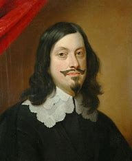
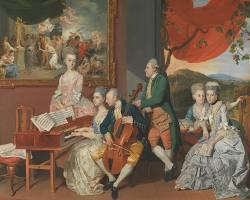
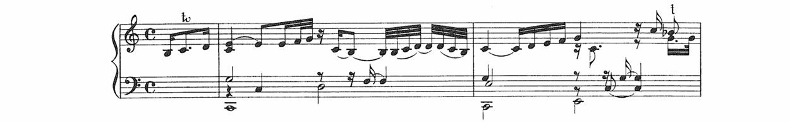
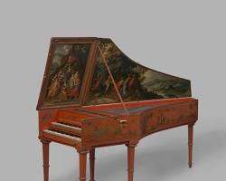
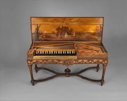
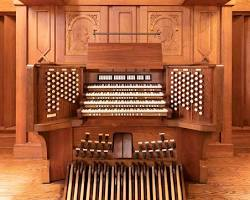
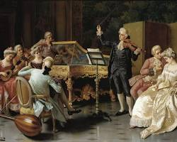

# Table of Contents
- [Timeline of Johann Jakob Froberger](#timeline-of-johann-jakob-froberger)
- [Lamento sopra la dolorosa perdita della Real Maesta di Ferdinando IV FBWV 612](#lamento-sopra-la-dolorosa-perdita-della-real-maesta-di-ferdinando-iv-fbwv-612)

  Listening guide
  
  Background of the Work
  
  Description of the Work
  
- [List of Other Important Works](#list-of-other-important-works)
- [Main instruments for his compositions](#main-instruments-for-his-compositions)
- [His Pioneering Role in Baroque Keyboard Development](#His-Pioneering-Role-in-Baroque-Keyboard-Development)

# Johann Jakob Froberger (1616-1667)

German composer
**Johann Jakob Froberger**(1616-1667) was a German composer who profoundly shaped the form of harpsichord music during the **early Baroque era**. His lifetime, spanning the mid-17th century, placed him squarely in a period of immense musical innovation and transition. This was a time when the **Baroque style** was truly taking hold, moving away from the polyphonic complexities of the Renaissance towards a more emphasis on **homophony**, **expressive melodies**, and the **basso continuo**. Froberger is recognized as a pioneer who not only advanced the technical capabilities of keyboard music but was also among the first to embed personal emotions within his compositions, a characteristic increasingly valued in the nascent Baroque period, which sought to evoke "affections" or specific emotional states in the listener.

Froberger's unique style emerged from a sophisticated synthesis of the prevailing musical trends of his time. He masterfully integrated the lyrical and expressive qualities of **Italian musical idioms**, which he encountered firsthand during his studies in Rome with masters like Frescobaldi. From France, he absorbed the elegant and ornate characteristics of **French musical idioms**, likely influenced by the refined courtly music he experienced. These elements were expertly combined with the rigorous and intellectual **German counterpoint tradition**, a cornerstone of German musical education. This sophisticated fusion created a highly influential body of work that exemplified the emerging Baroque ideal of blending national styles.

His compositions, often featuring programmatic titles and expressive contrasts, perfectly embodied the early Baroque's move towards dramatic intensity and emotional depth, significantly impacting later generations of composers and solidifying his legacy as a pivotal figure in early Baroque keyboard music.

# Timeline of Johann Jakob Froberger

| Year | timeline | 
| ---- | ----- |
| 1616 | Born in Stuttgart |
| c. 1634 | Traveled to Vienna, likely becoming an organist at the imperial court |
| 1637-1641 | Studied with Girolamo Frescobaldi in Rome |
| 1641 | Returned to Vienna and resumed his post at the imperial court |
| c. 1649 | Traveled to Dresden, Brussels, and London |
| 1657 | Resigned from his official post at the Viennese court, but remained in service for a time |
| 1662 | Moved to the court of the Duchess Sibylla of Württemberg-Montbéliard in Héricourt, France |
| 1667 | Died in Héricourt, France |

The "c." placed before a year is an abbreviation of the Latin word **"circa"**. It means "approximately" or "around".
It's used when the exact date or year is unknown, indicating that an event happened approximately at that time. For instance, "c. 1634" means "around 1634."

[Back to TOC](#table-of-contents)

# Lamento sopra la dolorosa perdita della Real Maesta di Ferdinando IV FBWV 612
[Music](https://www.youtube.com/watch?v=eJLRrH2oahU)

## Listening guide
| Time | Musical Contents |
| ----------- | ------------------------------------------------------------------------------------------------------------------------------------------- |
| 0:00 - 1:30 | Begins with slow, descending melodic figures and frequent dissonances, immediately establishing sorrow with a free, recitative-like rhythm. |
| 1:30 - 3:00 | Intensifies through chromatic progressions, repeated motives, and augmented/diminished chords, expressing mounting pain and unease.|
| 3:00 - 4:30 | Transitions to a calmer diatonic and homophonic texture, with gentle melodies and more consonances evoking peaceful contemplation. |
| 4:30 - 6:00 | Explodes with virtuosic passages, arpeggios, and intense dissonant clashes, reigniting emotional turmoil. |
| 6:00 - end  | Concludes in a slow minor key with fading melodies and long rests, leaving a sense of resigned sorrow and deep resonance.|

## Description of the Work

| Element        | Description                                                                |
| -------------- | -------------------------------------------------------------------------- |
| **Genre**      | Baroque keyboard music (*Lamento*, or lamentation)                         |
| **Dedication** | In memory of Ferdinand IV, King of the Romans                              |
| **Style**      | Free-form, slow-paced, introspective; features chromaticism and dissonance |
| **Symbolism**  | Descending scales evoke tears and sorrow (a common Baroque lament device)  |
| **Importance** | Early example of personal emotional expression in instrumental music       |

## Background of the Work

-> Ferdinanto iv

**The Lamento sopra la dolorosa perdita della Real Maestà di Ferdinando IV, FBWV 612**, stands as one of Johann Jakob Froberger's **most expressive and intimate keyboard works**. Composed around 1657, it served as a heartfelt elegy for the unexpected death of Ferdinando IV, King of the Romans and heir to the Holy Roman Empire, that same year. Ferdinando IV's untimely passing at the age of 19 was a significant blow to the Habsburg dynasty, as he was highly regarded as a **promising successor**.

Froberger, who maintained close connections with European courts and nobility, particularly the Imperial court in Vienna where he served for much of his career, conceived this Lamento as a deeply personal articulation of his grief and perhaps that of the court. The piece goes beyond mere formality, transforming personal sorrow into a universal musical language of lament. This work exemplifies his remarkable capacity to intertwine profound emotional depth with **sophisticated musical structure**, **showcasing his innovative use of dissonance**, **flexible rhythm**, and **dramatic contrasts** to convey a narrative of loss and mourning. It marks a pivotal moment in the development of expressive keyboard music during the **early Baroque period**, solidifying Froberger's reputation as a master of both technical virtuosity and emotional eloquence.

[Back to TOC](#table-of-contents)

# List of Other Important Works
| Year | Works                                                                | YouTube |  
| ------- | -------------------------------------------------------------------- | ------- |
| 1654 | Lamento sopra la dolorosa perdita della Real Maestà di Ferdinando IV | [Listen](https://youtu.be/CDEvG1hfvt4) |  
| unknown | Toccata in a minor, FbWV 101                                         | [Listen](https://www.youtube.com/watch?v=nKDr0a3AmIM)   |  
| unknown | Ricercar in d minor, FbWV 407                                        | [Listen](https://www.youtube.com/watch?v=urRrLrCy-EA)   |  
| unknown | Capriccio in G Major, FbWV 507                                       | [Listen](https://www.youtube.com/watch?v=X4ul8Yy-DiY)   |  
| unknown | Partita No.7 in e minor, FbWV 607                                    | [Listen](https://www.youtube.com/watch?v=IPylijBoipU)   |  

[Back to TOC](#table-of-contents)

# Main instruments for his compositions

**Harpsichord** - A keyboard instrument where a **plectrum** plucks the strings when a key is pressed. This action produces a bright, resonant, and often piercing sound that cannot sustain notes or easily vary in volume based on touch. Widely popular during the Renaissance and Baroque periods, the harpsichord was a cornerstone for both solo performance and continuo playing in ensembles. Its distinct timbre made it a defining voice of early music.
  

**Clavichord** - A keyboard instrument, widely used since the Middle Ages, where small metal blades called **tangents** strike the strings to produce sound. Unlike the harpsichord, the clavichord's unique mechanism allows for subtle control over dynamic nuances and even a vibrato effect called Bebung through finger pressure after the initial strike. This intimate and expressive instrument was primarily favored for private practice and small rooms due to its very soft volume.

**Organ** - A majestic wind instrument that produces sound by driving air (wind) through pipes, which are selected by pressing keys on a keyboard. Organs come in various sizes, from small portable instruments to massive church organs with thousands of pipes, offering an immense range of tonal colors and volumes. They were, and still are, central to religious music and classical compositions, renowned for their powerful and sustained sound.

[Back to TOC](#table-of-contents)

# His Pioneering Role in Baroque Keyboard Development

**Johann Jakob Froberger** was truly an **international composer**, a pivotal figure who, though perhaps less celebrated in mainstream awareness than later Baroque giants, laid crucial groundwork for the era's keyboard music. He was one of the earliest to seamlessly blend the rigorous **German counterpoint tradition** with the expressive lyricism of **Italian idioms** and the elegant ornamentation of **French styles**. This unique synthesis made his music extraordinarily rich and influential, setting a precedent for the cosmopolitanism that would define much of the Baroque period.

Froberger is particularly renowned for formalizing the standard order of movements—**Allemande, Courante, Sarabande, and Gigue**—within **keyboard suites**. This structural innovation provided a template that would be adopted and expanded upon by countless composers for generations. Beyond mere technical display, Froberger was ahead of his time in his ability to imbue his music with deeply personal feelings and experiences. His programmatic pieces and laments, like the poignant "Lamento sopra la dolorosa perdita della Real Maesta di Ferdinando IV," are prime examples of his innovative approach to emotional expression, a characteristic that became central to Baroque aesthetics.

His works subsequently exerted considerable influence on towering figures such as **François Couperin** in France and **Johann Sebastian Bach** in Germany, both of whom undoubtedly studied and learned from Froberger's pioneering efforts. Even today, Froberger's compositions remain indispensable for understanding the historical evolution of harpsichord and keyboard music, offering a vital link between the Renaissance and the High Baroque and showcasing the depth and innovation present even in the earlier stages of this rich musical period. His legacy, though sometimes overshadowed, is a testament to his groundbreaking contributions.

[Back to TOC](#table-of-contents)

---

Source: [wikipedia](https://en.wikipedia.org/wiki/Johann_Jakob_Froberger)

source:[The university of Melbourne](https://pursuit.unimelb.edu.au/articles/instrumental-reward-of-the-harpsichord)

Source: [Discover Campania](https://discovercampania.it/personaggi-storici/320-ferdinando-iv-di-borbone)

Source: [Arts at Harvey Mudd College](https://arts.hmc.edu/Roger-Lebow-Baroque-Cello-and-Stephan-Moss-Harpsichord)

---
