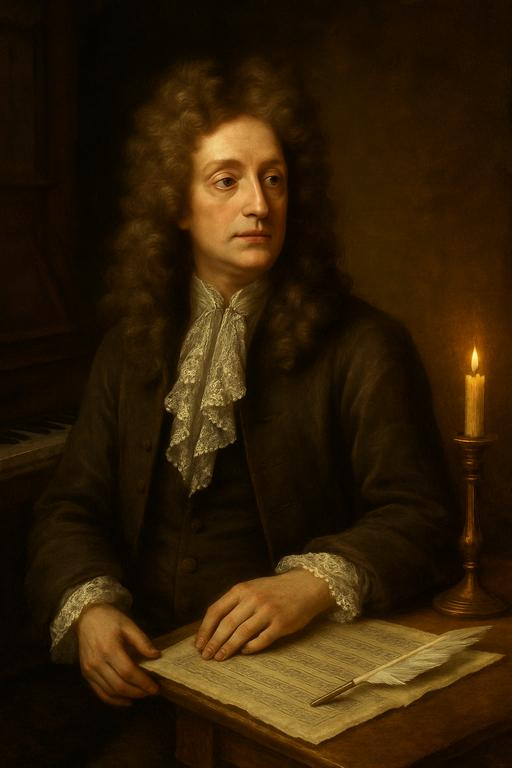
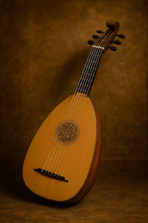
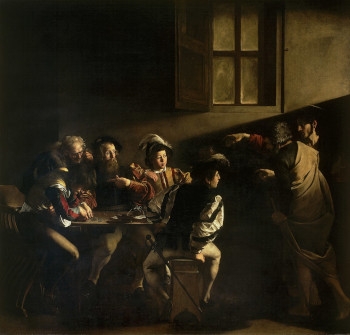

# Henry Purcell (1659-1695)
[^1]

[^1]:Credit: An image of Henry Purcell created by ChatGPT 4o, Jun 7, 2025, 11:02:54 PM, with the prompt "Create an image of Henry Purcell."

## Table of Contents
- [Learning Objectives](#-learning-objectives)
- [Purcell's Life](#purcells-life)
- [About Henry Purcell](#about-henry-purcell)
- [List of Important Works](#list-of-important-works)
- [Listening Tips](#-listening-tips)
- [Excerpt from Purcell's Music](#excerpt-from-purcells-music)
- [Instrument Used During this Period](#instrument-used-during-this-period)
- [Artworks from This Peroid](#artworks-from-this-period)
## 🎯 Learning Objectives

- Learn about the **Baroque period**, including its historical and musical characteristics.
- Understand the **life and work of Henry Purcell**, one of the leading English Baroque composers.
- Explore and analyze **Purcell’s music**, with a focus on expression, form, and instrumentation.

## Purcell's Life

| Year | Event |
|------|-------|
| 1659 | Henry Purcell was born in **London** |
| 1664 | Joined **the Chapel Royal** as a choirboy |
| 1673 | Began apprenticeship as tuner of **Westminster Abbey’s organ** |
| 1677 | Appointed composer for the **King’s string orchestra** |
| 1679 | Became organist at **Westminster Abbey** |
| 1682 | Appointed organist of **the Chapel Royal** |
| 1689 | Premiered the opera **Dido and Aeneas** |
| 1695 | Died and was buried in **Westminster Abbey** |

## About Henry Purcell

 Henry Purcell is **British composer**. Henry Purcell Britishized elements of Italian and French music to create his own creative original works. I want to create my own original music world like Henry Purcell. 
 
 Henry Purcell composed Theatre music the most. He also composed Opera and Sacred music. He was good at expressing emotions through melody and harmony. His aria **“Dido’s Lament”** from Dido and Aeneas is widely recognized for its emotional depth and is a hallmark of his style. Purcell died at the young age of 36, but he left behind a vast and diverse body of work. He worked as a court musician, composing prolifically during his short life.
Purcell greatly influenced later English composers like Edward Elgar and Benjamin Britten. Britten, in particular, was known for reinterpreting Purcell’s works, such as in his Variations on a Theme of Purcell.

A prominent instrumental composer contemporary with Henry Purcell was [Arcangelo Corelli](corelli_la_folia.md) (1653–1713). While Purcell focused primarily on vocal and theatrical music, Corelli developed the genres of the trio sonata and concerto, helping to establish the formal structure of Baroque instrumental music. He is regarded as a pioneer of Baroque instrumental style and had a significant influence on composers throughout Europe. 

Henry Purcell (1659–1695) lived and worked during a dynamic period in English and European history. His lifetime coincided with the Restoration era in England, following a period of political upheaval marked by **the English Civil War (1642–1651), the execution of King Charles I (1649), and the rule of Oliver Cromwell** during the Interregnum.

During Cromwell’s Puritan government, public stage plays and much secular music were suppressed. However, after the monarchy was restored in 1660 with King Charles II, there was a revival of the arts, particularly in theatre and music. The king, having lived in exile in France, brought with him a taste for continental (especially French and Italian) musical styles. This cosmopolitan influence became a key part of the cultural atmosphere in which Purcell matured as a composer.

**Purcell's Musical Role in Restoration England**
Purcell flourished in this post-Restoration cultural renewal. He became organist at Westminster Abbey and later a court composer, producing a wide range of works for church, stage, and royal ceremonies. His music often served royal and public functions, such as coronations, funerals, and theatrical performances. One of his most famous pieces, the Funeral Music for Queen Mary (1695), not only shows his mastery of solemn expression but also reflects the political and religious gravity of national events.

**Theatrical and Operatic Works**
Purcell’s operas and semi-operas, such as Dido and Aeneas (1689), King Arthur (1691), and The Fairy Queen (1692), were written during a time when English drama and music were merging in new ways. These works blend spoken dialogue, dance, and music, often performed in London’s flourishing public theatres. Dido and Aeneas, one of the earliest English operas, also reflects the influence of French tragedie lyrique and Italian opera, which Purcell adapted to suit English tastes and language.

**Fusion of European Styles**
Purcell masterfully synthesized Italian melodic expressiveness, French rhythmic elegance, and English choral traditions. This fusion was not only a reflection of his personal genius, but also a product of the cross-cultural exchanges happening across Europe during the Baroque era, with music styles and ideas flowing freely between courts and composers.

**Legacy in Context**
Although he died young, Purcell’s work became a symbol of English musical identity during a time when England was redefining itself politically, culturally, and religiously. His music captured the spirit of Restoration England—both its grandeur and its emotional complexity. His influence continued into the 20th century, especially through Benjamin Britten, who reinterpreted his themes for modern audiences. [Back to TOC](#table-of-contents)

## List of Important Works

| Year |  Works | Youtube |
| ---- | -----  | ------- |
| 1689 | Dido and Aeneas | [Listen](https://youtu.be/-H--Z9UzQYE?si=hhPvbfOcrym9cYwL) |
| 1691 | King Arthur | [Listen](https://youtu.be/8P4yC3HMxkQ?si=VhF6QGqyuEOnB4ps) |
| 1692 | The Fairy Queen | [Listen](https://youtu.be/QAvS3AypQfI?si=S1eaYmEOkG-Jn9lp) |
| 1664 | The Indian Queen | [Listen](https://youtu.be/-j7tjTuDpvg?si=Ig_Rcu7owkKr8K_l) |
| 1691 | The Cold Song | [Listen](https://youtu.be/Q8K8wFk-tn8?si=HxScwQTPUBwevTql) |

### 🎼 Listening Tips

- Pay attention to the use of **ground bass (basso ostinato)** in emotional scenes.
- Observe the contrast between **solo arias**, **choruses**, and **instrumental passages**.
- Notice how Purcell uses **text painting** to enhance the meaning of the lyrics.
- Focus on how **musical elements reflect dramatic tension and emotion**.

## Excerpt from Purcell's Music

[Back to TOC](#table-of-contents)

## Instrument Used During This Period

[^2]

**The Lute** is a plucked string instrument popular in the Middle Ages and Renaissance, known for its rounded back and gentle tone.  
It was widely used in early European music for both solo performance and accompaniment.

[^2]:Credit: An image of Lute created by ChatGPT 4o, Jun 7, 2025, 11:12:39 PM, with the prompt "Create an image of Lute used during the period of Henry Purcell."

## Artworks from This Period

[^3]

[^3]:Credit: The Calling of Saint Matthew by Caravaggo, 1599-1600, Public Domain, [Wikimedia Commoms](https://commons.wikimedia.org/wiki/File:The_Calling_of_Saint_Matthew-Caravaggo_(1599-1600).jpg)

[Back to TOC](#table-of-contents)

