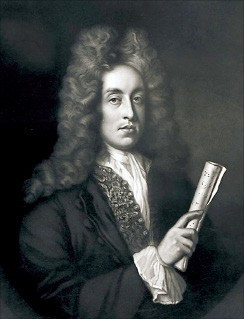

# Henry Purcell (1659-1695)

 Henry Purcell is British composer. Henry Purcell Britishized elements of Italian and French music to create his own creative original works. I want to create my own original music world like Henry Purcell. 
 
 Henry Purcell composed Theatre music the most. He also composed Opera and Sacred music. He was good at expressing emotions through melody and harmony. His aria “Dido’s Lament” from Dido and Aeneas is widely recognized for its emotional depth and is a hallmark of his style. Purcell died at the young age of 36, but he left behind a vast and diverse body of work. He worked as a court musician, composing prolifically during his short life.
Purcell greatly influenced later English composers like Edward Elgar and Benjamin Britten. Britten, in particular, was known for reinterpreting Purcell’s works, such as in his Variations on a Theme of Purcell.

A prominent instrumental composer contemporary with Henry Purcell was [Arcangelo Corelli](Arcangelo_Corelli.md) (1653–1713). While Purcell focused primarily on vocal and theatrical music, Corelli developed the genres of the trio sonata and concerto, helping to establish the formal structure of Baroque instrumental music. He is regarded as a pioneer of Baroque instrumental style and had a significant influence on composers throughout Europe.

## Henry Purcell and the Baroque Era

## List of Important Works

| Year |  Works | Youtube |
| ---- | -----  | ------- |
| 1689 | Dido and Aeneas | [Listen](https://youtu.be/-H--Z9UzQYE?si=hhPvbfOcrym9cYwL) |
| 1691 | King Arthur | [Listen](https://youtu.be/8P4yC3HMxkQ?si=VhF6QGqyuEOnB4ps) |
| 1692 | The Fairy Queen | [Listen](https://youtu.be/QAvS3AypQfI?si=S1eaYmEOkG-Jn9lp) |
| 1664 | The Indian Queen | [Listen](https://youtu.be/-j7tjTuDpvg?si=Ig_Rcu7owkKr8K_l) |
| 1691 | The Cold Song | [Listen](https://youtu.be/Q8K8wFk-tn8?si=HxScwQTPUBwevTql) |

