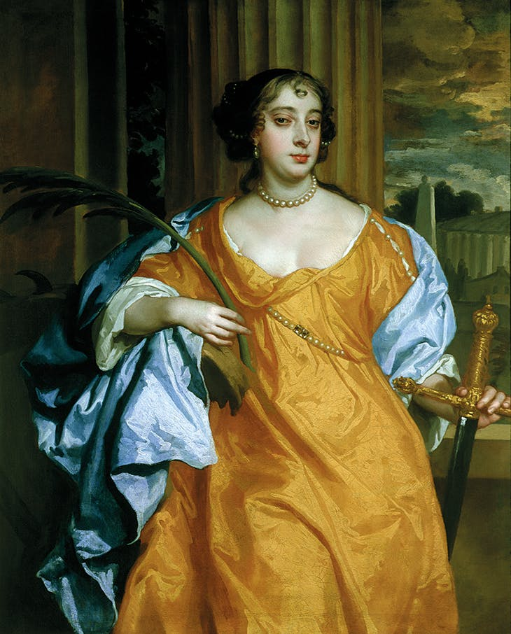

# Henry purcell (1659-1695)
[^1] 

[^1]: Credit: Portrait of hernypurcell by John Closterman, circa 1695 or after, Public Domain, [Wikimedia Commons](https://commons.wikimedia.org/wiki/File:Henry_Purcell_Closterman.jpg)

**Henry Purcell** (1659-1695) is **British** composer. He was a prolific British composer who created significant works across various genres. He is highly regarded for establishing a distinct **British musical style**. Purcell skillfully blended continental European techniques with the unique qualities of the English language. He was exceptional at setting English text to music, capturing its natural rhythm and conveying deep emotion. His vocal compositions were a notable inspiration for subsequent composers. Purcell expertly combined **Baroque harmonic techniques** with Renaissance contrapuntal skills, creating rich and deep music. His instrumental works also showcased this technical mastery and clear construction. Purcell's contribution to theatre music, particularly **semi-opera**, was immensely significant. He effectively used music to portray dramatic emotion, atmosphere, and character states on stage.
In conclusion, Purcell's music is marked by originality, technical skill, and emotional expressiveness, blending English tradition with Baroque innovation.

[^2]

[^2]: Credit: **Barbara Villiers, Duchess of Cleveland as St Catherine of Alexandria**, by Peter Lely, 1667, Public Domain, [Wikimedia Commons](https://commons.wikimedia.org/wiki/File:Barbara_Villiers_as_St_Catherine_of_Alexandria.jpg)

This era of vibrant English culture, marked by Purcell's musical innovations, also saw significant developments in visual arts. A prominent figure in painting during this period was Sir Peter Lely (1618-1680), who served as the principal painter to King Charles II. Lely is well-known for his portraits of the English court and aristocracy. Among his notable works is the painting titled **Barbara Villiers, Duchess of Cleveland as St Catherine of Alexandria**. Barbara Villiers was a famous figure at the court, known as one of King Charles II's mistresses. During the 1660s, she served as a muse for Lely and appeared in numerous portraits by him. This painting, depicting her in the guise of Saint Catherine of Alexandria, is a faithful representation of the original public domain artwork and is part of the Royal Collection. It exemplifies the artistic style and prominent figures of the English Restoration period, much like Purcell's music reflects the era's musical landscape. he produced a vast and remarkable body of work across a wide range of genres, including sacred music, theatre music, court music, and various forms of instrumental and vocal compositions.

## Table of Contents

- [A Timeline of His Life](#a-timeline-of-his-life)
- [List of Important Works](#list-of-important-works)
- [Rondeau](#rondeau)
- [Listening Guide](#listening-guide)
- [Key Features](#key-features)

  
## A Timeline of His Life

| Year | Contents |
| ---- | -------- |
| c.1659   | Born in Westminster, London, England. His father, also named Henry Purcell, was a Gentleman of the Chapel Royal. He had an elder brother. |
| c.1664   | His father died when Henry was about five years old. He and his brothers were then raised by their uncle, Thomas Purcell, who was also a musician and Gentleman of the Chapel Royal.  |
| c.1669  | Became a choirboy in the Chapel Royal. He received musical education from Henry Cooke and later from Pelham Humfrey, both masters of the Chapel Royal children.    |
| c.1673   | Left the choir when his voice broke and became an apprentice to John Hingston, the Keeper of the King's Instruments and an organ builder.  |
| c.1677  | Appointed composer for the King's Violins.   |
| c.1679  | Succeeded Benjamin Rogers as organist of Westminster Abbey.     |
| c.1682   | Appointed one of the three organists of the Chapel Royal, while still holding his position at Westminster Abbey.   |
| c.1683    | Became the organ maker and Keeper of the King's Instruments, the post formerly held by his teacher, John Hingston.  |
| c.1689      | Composed his only true opera, **Dido and Aeneas**, for a girls' school in Chelsea.  |
| c.1690s     | Prolifically composed incidental music for plays, odes, and other vocal and instrumental works. Notable theatrical works include **King Arthur** and **The Fairy-Queen**. |
| c.1695 | Died on November 21, 1695, at his house in Westminster, likely around age 36. He was buried in Westminster Abbey. |

## List of Important Works

| Year |         Works        | Youtube |
| ---- |   ---------------    | ------- |
| 1689 |    Dido and aeneas   |[Listen](https://youtu.be/GYdfxNYAVG4?si=-NjtsOo3Q9RcGVk)|
| 1695 |       Abdelazer      |[Listen](https://youtu.be/GsbPJehQnBA?si=7v2XQjelNaBfe8e)     |
| 1690 | Te Deum and Jubilate | [Listen](https://youtu.be/tSczTHWZWZ0?si=kbbZGPFwpHZgfkhD)    |
| 1692 |    The Fairy Queen   | [Listen](https://youtu.be/K7AbzbN-MqA?si=-rYLcHpVdfe6v2Eb)  |
| 1691 |      King Arthur     | [Listen](https://youtu.be/8P4yC3HMxkQ?si=ydjrxGVyKLRp33Dj)    |

## Rondeau
[Listen](https://youtu.be/Y1CpzSORmEY?si=HPYD50II0Er4vc_-)

This Rondeau is the second movement of the **Abdelazer Suite, Z.570**, composed by the English composer Henry Purcell in 1695. It was originally written as incidental music for the play *Abdelazer[^3], or The Moor's Revenge* by Aphra Behn.
The piece is structured in the rondo form, featuring a main theme that returns repeatedly between contrasting sections. The theme of this Rondeau is particularly famous because it was used by Benjamin Britten in his well-known composition, 'The Young Person's Guide to the Orchestra' (Variations and Fugue on a Theme of Purcell), composed in 1946. Britten's work brought Purcell's theme to international prominence, making it one of his most widely recognized melodies and a popular choice for music education.

[^3]: A 1676 revenge tragedy play by Aphra Behn, for which Purcell composed incidental music.

## Listening Guide
| Timing    | Text and Form  | Description                                                                                                                                 |
| :-------- | :------------- | :------------------------------------------------------------------------------------------------------------------------------------------ |
| 0:00 - 0:15 | Refrain[^4]       | The main theme of the piece, appearing repeatedly to form the structural backbone of the piece.                                                |
| 0:15 - 0:29 | First Couplet[^5]  | The first contrasting section. It varies the melody, rhythm, or harmony from the theme, but still blends into the overall atmosphere of the piece. |
| 0:29 - 0:43 | Refrain        | The main theme reappears, providing stability.                                                                                                  |
| 0:43 - 0:58 | Second Couplet | The second contrasting section, presenting another new musical idea.                                                                            |
| 0:58 - 1:12 | Refrain        | The main theme is repeated once again.                                                                                                     |
| 1:12 - 1:41 | Third Couplet  | The third contrasting section.                                                                                                                |
| 1:41 - 1:55 | Refrain        | The main theme reappears.                                                                                                                    |
| 1:55 - 2:13 | Fourth Couplet | The fourth contrasting section.                                                                                                               |
| 2:13 - End  | Refrain        | The main theme is repeated for the last time, concluding the piece.                                                                          |

[^4]:In rondo form, the principal theme that recurs throughout the piece.
[^5]:In rondo form, a contrasting section that appears between repetitions of the main theme (Refrain).

## Key Features

*   **Incidental Music of the Baroque Period:** It is part of the incidental music played during intermissions of plays in English theaters in the late 17th century.
*   **Simple and Clear Form:** The rondo form clearly shows the repetition and contrast of themes, making it easy to understand.
*   **Triple Meter:** This piece uses a simple rhythm in 3/2 time, with three half-note beats per measure.
*   **Clear Melody:** The main melody is primarily played by the first violin, leading the piece.
*   **Instruments Used:** Henry Purcell composed a piece based on this theme to introduce the instruments of the orchestra, making it educationally significant.[^6]

[^7]

[^6]: Originally composed for a theater music ensemble of the late 17th century, it uses string, woodwind, and brass instruments. It is now performed and arranged in various instrumentations.
[^7]: Credit: *Orchestra of Dr Williams' School, Dolgellau* by Geoff Charles,	1 February 1953, Public Domain, [Wikimedia Commons](https://commons.wikimedia.org/wiki/File:Orchestra_of_Dr_Williams%27_School,_Dolgellau_(1473135).jpg)
*   [Back to TOC](#table-of-contents)
