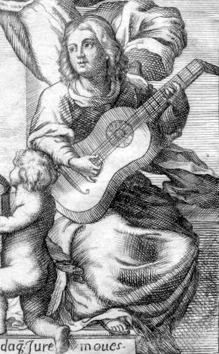
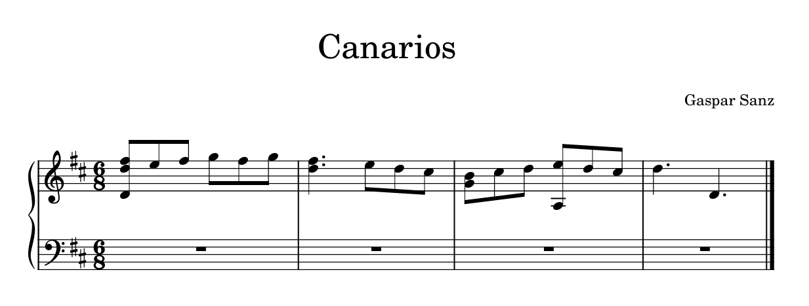
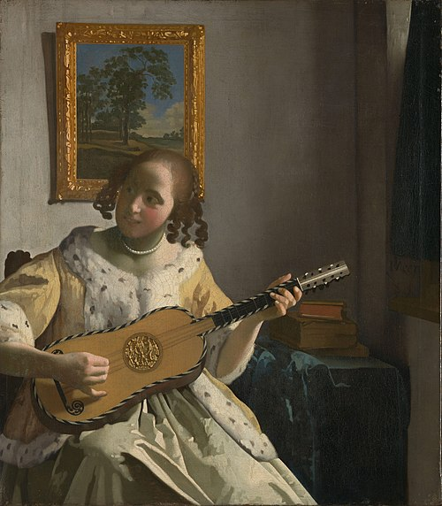

# 🎼 Gaspar Sanz (Francisco Bartolomé Sanz Celma, 1640–1710)

  
*Possibly a portrait of Gaspar Sanz, from the dedication page of* *Instrucción de Música sobre la Guitarra Española*

---

## 🧠 Table of Contents
- [🕵️ Something to Think About](#something-to-think-about)
- [📅 About Gaspar Sanz](#-about-gaspar-sanz)
- [🏛️ Historical Context and Importance](#historical-context-and-importance)
- [📄 List of Important Works](#-list-of-important-works)
- [🎵 Listening Guide of *Canarios*](#-listening-guide-of-canarios)
- [🎸 Instrument: Baroque Guitar](#-instrument-baroque-guitar)
- [❓ Why Gaspar Sanz?](#-why-gaspar-sanz)
- [📋 Credits](#-credits)

---

## 🕵️ Something to Think About

1. How did Gaspar Sanz contribute to transforming the guitar from a folk to an art music instrument?
2. In what ways did Sanz’s Italian musical training influence his compositions and methods?
3. Does Sanz reflect the cultural spirit of the Spanish Baroque?
4. How did his pedagogical works shape the classical guitar tradition?

[Back to TOC](#-table-of-contents)

---

## 📅 About Gaspar Sanz

| Year | Event |
| ---- | ----- |
| 1640 | Born in Calanda, Aragón, Spain |
| 1650s–1660s | Studied theology and philosophy at Salamanca University |
| 1660s | Studied music and guitar in Italy, especially Rome |
| 1674 | Published the first volume of his pedagogical trilogy |
| 1670s | Taught guitar to Don Juan, son of King Felipe IV |
| 1697 | Released the third and final volume of his work |
| ~1710 | Believed to have died around this year |

Gaspar Sanz was a Spanish composer, Baroque guitarist, and Catholic priest. After theological studies in Spain, he pursued music in Rome, where he studied under respected musicians like **Lelio Colista**. Sanz returned to Spain as a skilled guitarist, eventually tutoring noble pupils and writing a comprehensive guitar method.

His three-volume *Instrucción de Música sobre la Guitarra Española* outlined foundational techniques: **punteado** (plucking) and **rasgueado** (strumming). He employed **tablature notation** and an **alphabet-based chord system** similar to today's Nashville Number System. These innovations solidified the Baroque guitar's place in art music and influenced generations of guitarists.

[Back to TOC](#-table-of-contents)

---

## 🏛️ Historical Context and Importance

During Sanz’s lifetime, the guitar transitioned from a rustic folk instrument to one embraced in courts and salons. His pedagogical books, published from 1674 to 1697, document and accelerate this evolution. They preserve numerous **Spanish and Italian dance forms** like the *folía*, *canarios*, and *jácaras*, providing insight into both elite and popular musical cultures.

By meticulously explaining techniques and notating them in accessible formats, Sanz helped legitimize the guitar as a serious instrument. His influence extended beyond Spain, laying the groundwork for classical guitar traditions that followed.

[Back to TOC](#-table-of-contents)

---

## 📄 List of Important Works

| Year | Title | Listen |
| ---- | ----- | ------ |
| 1674 | *Instrucción de Música sobre la Guitarra Española* | [YouTube](https://youtu.be/MOcsy1Ewj6M?feature=shared) |
| 1675 | *Libro Segundo de Cifras sobre la Guitarra Española* | *(Link unavailable)* |
| 1697 | *Libro Tercero de Música de Cifras sobre la Guitarra Española* | *(Link unavailable)* |

[Back to TOC](#-table-of-contents)

---

## 🎵 Listening Guide of *Canarios*

**0:00 – Opening Statement**  
Bright and spirited tempo. Hemiola rhythms (duple/triple alternation) immediately establish dance energy.

**0:15 – Rhythmic Drive & Ornamentation**  
Repetitive rhythmic motifs propel the piece forward. Baroque ornamentation (trills, mordents) enhances expressiveness.

**0:30 – Binary Form (A–A–B–B)**  
Section A is repeated with slight variations. Section B introduces new melodic material while retaining rhythmic intensity.

**0:45 – Technique and Conclusion**  
Alternation between **punteado** and **rasgueado** showcases the Baroque guitar's dual function as melodic and rhythmic instrument.

[Back to TOC](#-table-of-contents)

---

## 🎸 Instrument: Baroque Guitar

  
*Painting: "The Guitar Player" by Johannes Vermeer*

The **Baroque guitar** was a five-course gut-stringed instrument popular in 17th–18th century Europe. It bridged the Renaissance guitar and modern classical guitar.

Known for its **campanella** (bell-like resonance) and **strummed arpeggios**, it supported both melody and harmony in solo and ensemble contexts. Its refined sound and versatility made it ideal for composers like **Gaspar Sanz** and **Robert de Visée**.

[Back to TOC](#-table-of-contents)

---

## ❓ Why Gaspar Sanz?

As a classical guitarist and student of musicology, I’ve often noticed that guitar composers like Sanz are underrepresented in mainstream historical narratives. Yet Sanz’s contributions were groundbreaking.

His three-volume instructional work remains vital to guitar pedagogy. He codified essential techniques and championed a notation system that enhanced accessibility. His compositions, rooted in both popular and courtly traditions, continue to inspire performers and scholars alike.

Gaspar Sanz offers a crucial perspective in understanding the development of the classical guitar, Spanish Baroque music, and the broader role of plucked string instruments in Western art music.

[Back to TOC](#-table-of-contents)

---

## 📋 Credits

- Portrait: Dedication page from *Instrucción de Música sobre la Guitarra Española*  
- Guitar image: *The Guitar Player* by Johannes Vermeer  
- Score Image: Facsimile of Sanz’s published works  
- Listening link: YouTube (performance of *Canarios*)

Thanks to historical archives, digital libraries, and Baroque performance scholars who make this research possible.

