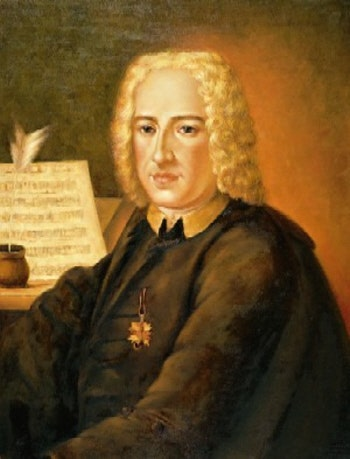

# Alessandro Scarlatti (1660–1725)

Alessandro Scarlatti (1660-1725) is an Italian composer. He played a crucial role in establishing the Neapolitan opera tradition. He codified the da capo aria, which became central to Baroque vocal music, and composed over 600 cantatas that remain essential for the study of the period.
His work laid the foundation for Classical opera, and his techniques in orchestration—particularly his use of instrumental color and texture—significantly influenced the development of later symphonic writing. I was drawn to Scarlatti because, although he is not as frequently mentioned as some other composers, he was instrumental in shaping the structural and expressive core of Baroque vocal music. His codification of the da capo aria and immense cantata output provide a fascinating starting point for exploring how his work influenced later Classical composers.

## List of Important Works

| Year | Works                 | YouTube |
| ---- | --------------------- | ------- |
| 1690 | La Rosaura            | [Listen](https://youtu.be/KdR2p5yNLcI?si=fvbOdb5_qEOBKWG7) |
| 1707 | Il Mitridate Eupatore | [Listen](https://youtu.be/S2axvtlURCU?si=aN0e1uxjiMFJptdn) |
| 1721 | Griselda              | [Listen](https://youtu.be/k4Nef6XL9mA?si=nzlFHLefP8tyhugx) |
