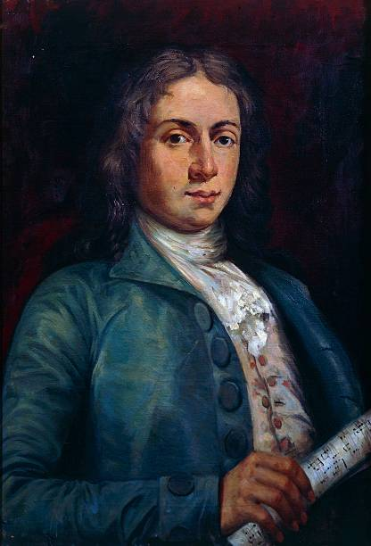
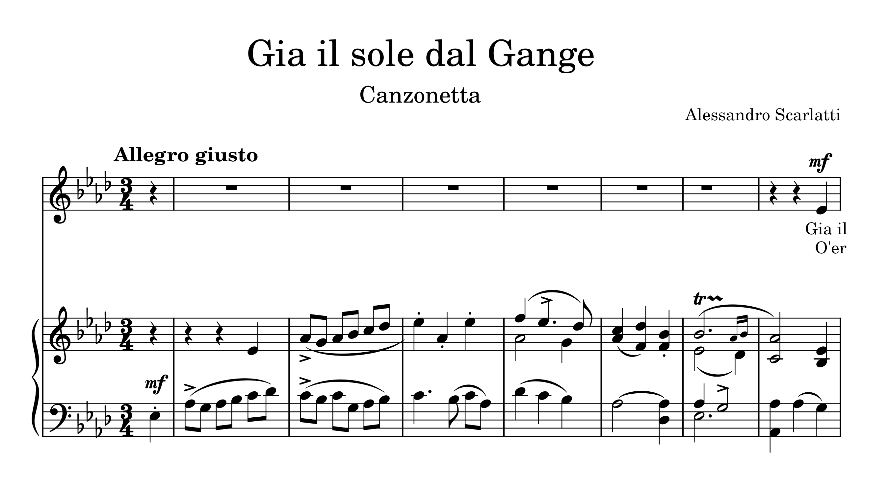

# Alessandro Scarlatti (1660–1725)

> ### ***The Architect of Neapolitan Opera: Alessandro Scarlatti’s Enduring Influence***

> Credit: Portrait of Scarlatti by Unknown, 17-18th Century, Public Domain, [Wikimedia Commons](https://commons.wikimedia.org/wiki/File:Alessandro_Scarlatti.png)

## 📍Learning Objectives
By reading this article, readers will gain an understanding of Alessandro Scarlatti’s foundational role in shaping Neapolitan opera and Baroque vocal music. They will be able to identify key features of the Baroque style through his works, grasp the structure and importance of the *da capo aria*, and appreciate how his innovations influenced later composers such as Handel, Mozart, and Haydn. Special attention is given to *Gia il sole dal Gange*, which serves as a gateway to understanding Scarlatti’s expressive voice and enduring legacy.

## 📑Table of Contents
- [About Alessandro Scarlatti](#about-alessandro-scarlatti)
- [Life Story](#life-story)
- [Why Important](#why-important)
- [List of Important Works](#list-of-important-works)
- [Gia il sole dal Gange](#gia-il-sole-dal-gange)
- [Listening Guide](#listening-guide)

## 🎼About Alessandro Scarlatti
Alessandro Scarlatti (1660–1725) is an Italian composer who played a crucial role in establishing the Neapolitan opera tradition during the **Baroque** period, a time when music was becoming increasingly expressive, ornate, and structured around contrast and drama. He codified the *da capo aria*, which became central to Baroque **vocal music** and served as a structural model for arias throughout the 18th century. Scarlatti composed over 600 cantatas that remain essential for the study of the period, reflecting the Baroque interest in emotional expression, formal clarity, and vocal virtuosity.

His influence extended beyond his own work through his son, [Domenico Scarlatti](scarlatti_domenico_keyboard_sonata_k80.md), who became a renowned composer in his own right. The elder Scarlatti’s mastery of vocal and dramatic forms helped shape Domenico’s early musical education, laying the foundation for his later innovations in **keyboard music**.

## 🧭Life Story

| Year | Location        | Event                                         |
|------|-----------------|-----------------------------------------------|
| 1660 | Palermo, Sicily | Born                                                        |
| 1672 | Rome            | Moved to Rome, began studying music with Giacomo Carissimi  |
| 1679 | Rome            | Premiere of *Gli equivoci nel sembiante*, gained patronage  |
| 1684 | Naples          | Appointed maestro di cappella at the Viceroy’s court        |
| 1700 | Naples          | Helped establish the Neapolitan opera style                 |
| 1725 | Naples          | Died    

He was born in Palermo, Sicily, in 1660. Around the age of twelve, he moved to Rome, where he is believed to have studied music under Giacomo Carissimi. His early works suggest influences from Stradella and Legrenzi, indicating a possible connection to northern Italian musical trends of the time. Following the successful premiere of his opera Gli equivoci nel sembiante in 1679, he gained the patronage of Queen Christina of Sweden, residing in Rome, and became her maestro di cappella.

In 1684, he took a significant position as maestro di cappella at the court of the Viceroy in Naples, a city that would become the epicenter of Italian opera. Naples, during the Baroque era, was a thriving cultural and political hub under Spanish rule, and Scarlatti’s music responded to the demands of a court culture that valued both spectacle and refinement. His long service there contributed to the solidification of **the Neapolitan style**, characterized by clear melodic lines, dramatic contrasts, and expressive ornamentation—all hallmarks of the Baroque aesthetic. 

> **To express the persuasiveness of the lyrics, he employed every kind of dissonance, and then resolved those dissonances so masterfully that even the most beautiful consonances could not match the sweetness and harmony of his dissonances.**
— François Raguenet, Parallèle des Italiens et des Français en ce qui regarde la musique et les opéras (1702) [Back to TOC](#table-of-contents)

## ⭐Why Important
His work laid the foundation for **Classical opera**, and his techniques in orchestration—particularly his use of instrumental color and texture—significantly influenced the development of later symphonic writing. Scarlatti’s music reflects the larger Baroque emphasis on emotional depth, formal structure, and contrasts between solo and ensemble textures. He was also a central figure in the evolution of **recitative and aria** forms, which would become standard in opera for the next century.

> * Giovanni Battista Gaulli, “Triumph of the Name of Jesus” (1676–79), ceiling fresco, Church of the Gesù, Rome. A quintessential Baroque masterpiece noted for its dramatic use of space, light, and emotion. *

> Credit: Triumph of the Name of Jesus by Giovanni Battista Gaulli, 1672-1677, Public Domain, [Wikimedia Commons](https://commons.wikimedia.org/wiki/File:G.B.Gaulli-Triumph_of_the_Name_of_Jesus.jpg)

This dramatic and expressive quality in Scarlatti’s work parallels the visual language of Baroque art. For example, **Giovanni Battista Gaulli**’s ceiling fresco *“Triumph of the Name of Jesus”* (1676–79), located in the Church of the Gesù in Rome, is a powerful visual counterpart to the theatricality of Baroque music. The painting’s intense contrasts of light and shadow, illusionistic perspective, and emotional grandeur mirror Scarlatti’s use of harmonic tension, dissonance, and resolution to evoke awe and passion. Both artists aimed to move the audience deeply—whether through soaring melodies or divine imagery.

I was drawn to Scarlatti because, although he is not as frequently mentioned as some other composers, he was instrumental in shaping the structural and expressive core of **Baroque vocal music**. His codification of the da capo aria and immense cantata output provide a fascinating starting point for exploring how his work influenced later Classical composers like Handel, Mozart, and even Haydn, who inherited the expressive vocabulary and formal clarity that Scarlatti helped define within his historical context.

As we mark the *300th anniversary* of his death in 2025, it is an especially meaningful time to reflect on his enduring legacy and his vital contributions to vocal music. [Back to TOC](#table-of-contents)

## 🎶List of Important Works

| Year | Works                 | YouTube |
| ---- | --------------------- | ------- |
| 1680 | L'honestà negli amori | [Listen](https://youtu.be/7XlRplcM3X8?si=uT1w7Tt-SM9_DY1x) |
| 1707 | Il Mitridate Eupatore | [Listen](https://youtu.be/S2axvtlURCU?si=aN0e1uxjiMFJptdn) |
| 1721 | Griselda              | [Listen](https://youtu.be/k4Nef6XL9mA?si=nzlFHLefP8tyhugx) |

## 🌅Gia il sole dal Gange ##
*「Gia il sole dal Gange」* originates from his second opera, *L'onestà negli amori*, which premiered on February 3, 1680, at the Palazzo Bernini theater in Rome. At the time, Scarlatti was only 19 years old, and this aria is considered one of the most representative works of his early compositional talent and expressive sensitivity.

The piece describes the rising sun over the Ganges River, and is characterized by its bright, cheerful mood, lively melody, and refined emotional nuance—all hallmarks of the Baroque style. It is most commonly performed as **a soprano solo aria** and, though brief, it is frequently included in vocal recitals due to its beautiful melodic lines and the vocal agility it demands, making it a favorite in the Baroque vocal repertoire.

**Instrumentation:**
* Voice: Usually a soprano or tenor (high vocal range) soloist
* String Orchestra: Consisting of violins, violas, cellos, and double basses, forming a four-part string section for the accompaniment

> Credit: An image of string orchestra created by Gemini, Jun 3, 2025, 12:46 PM, with the prompt "creat an image of string orchestra instruments." 

## 🎧Listening Guide

[Gia il sole dal Gange](https://youtu.be/PQV4d_Peux0?si=B6UEE0s1P5FqAvAi) (⬅️Click)

| Time     | Section / Lyrics               | What to Listen For                                                                 |
|----------|--------------------------------|-------------------------------------------------------------------------------------|
| 0:00–0:10 | "Gia il sole dal Gange"        | Bright, joyful opening; rising melodic contour evokes the sun rising over the Ganges. |
| 0:11–0:20 | "Più chiaro sfavilla"          | Clearer tone and a sense of radiance; notice how the vocal line mirrors shimmering light. |
| 0:21–0:35 | "E terge ogni stilla"          | Smoother legato phrasing; listen for subtle dynamic shaping in both voice and strings. |
| 0:36–0:50 | "Dell’alba che piange"         | A brief moment of lyrical contrast; minor inflection suggests emotional nuance. |
| 0:51–1:10 | Repeat: "Gia il sole dal Gange" | Return of opening line with added ornamentation; listen for expressive trills or grace notes. |
| 1:11–1:30 | Repeat: "Più chiaro sfavilla"   | Notice increased vocal agility; brighter timbre with more embellishments.            |
| 1:31–1:50 | "E terge ogni stilla..."       | Elegant conclusion; final cadences show off the singer’s breath control and tone.   |
| 1:51–2:00 | Closing cadence                 | Light and graceful ending; strings provide a warm, supportive resolution.           |

> **Tips for Listening:**
> - Focus on how the melody "paints" the imagery (sunlight, tears, radiance).
> - Note how Scarlatti balances vocal virtuosity with lyrical expressiveness.
> - Try to follow the Italian text to connect music with meaning.

[Back to TOC](#table-of-contents)
