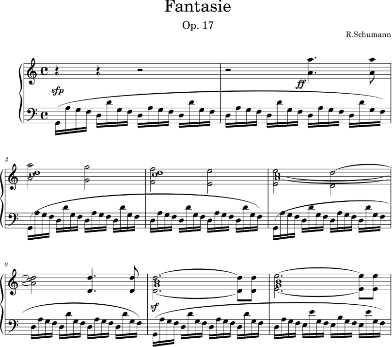

# Robert Schuammn (1810–1856)

 

**Robert Schumann** was a German composer and music critic, renowned as a leading figure of the Romantic era. Initially aspiring to become a pianist, a hand injury redirected his focus to composition. His works, deeply influenced by his love of literature and poetry, are known for their emotional depth and lyrical beauty. Schumann married Clara Wieck, a virtuoso pianist, in 1840, a union that inspired many of his compositions. His music includes groundbreaking piano pieces, lieder cycles like *Dichterliebe*, and orchestral works such as the *Piano Concerto in A minor*. Though he faced mental health struggles, his legacy endures through his innovative and poetic contributions to music.

---

- [Timeline](#timeline)
- [Fantasie Op. 17](#fantasie-op-17)
  - [Background](#background)
  - [Structure and Features](#structure-and-features)
    - [First Movement: Durchaus phantastisch und leidenschaftlich vorzutragen](#first-movement-durchaus-phantastisch-und-leidenschaftlich-vorzutragen)
    - [Second Movement: Mäßig. Durchaus energisch](#second-movement-mäßig-durchaus-energisch)
    - [Third Movement: Langsam getragen. Durchweg leise zu halten](#third-movement-langsam-getragen-durchweg-leise-zu-halten)
  - [Legacy](#legacy)
- [Influences](#influences)
- [Listening Guide](#listening-guide)
- [Questions for Review](#questions-for-review)
- [Guides for Further Studies](#guides-for-further-studies)
  
---

## Timeline

| Year | Event |	Description | Youtube |
| ---- | ----- | ------------ | ------- |
| 1810 | Birth | Robert Schumann is born in Zwickau, Saxony, Germany. |
| 1828 | Studying law | Schumann begins studying law in Leipzig, but his passion for music grows. | 
| 1830 | Focus on music | After an injury to his hand, Schumann shifts from aspiring pianist to composer. |
| 1834 | Founding music journal | Schumann co-founds Neue Zeitschrift für Musik, establishing himself as a music critic. | 
| 1835 | Meeting Clara Wieck | Schumann falls in love with Clara Wieck, leading to a passionate and challenging relationship. |
| 1836 | Composing the Fantasy | Schumann composes the Fantasy in C Major, Op.17, inspired by his love for Clara and his admiration for Beethoven. |
| 1837 | Revisions | Schumann revises and refines the Fantasy, finalizing it as a work of personal expression. |
| 1839 | Publication | The Fantasy in C Major is published as Op.17 and dedicated to Franz Liszt. | [Listen](https://youtu.be/ZRZjHKX-JMA?si=Q22z0SyJQdcYoJHJ) :tv:|
| 1840 | Year of Song | Schumann marries Clara, and his compositional focus shifts to song cycles, including Dichterliebe. |
| 1854 | Mental health crisis | Schumann experiences a severe mental health breakdown, leading to hospitalization. |
| 1856 | Death | Schumann dies in a mental asylum near Bonn, leaving behind a legacy of profound and emotional music. |

---

## Fantasie Op. 17

 

### Background

Schumann’s Fantasy in C Major, Op.17 is one of his most celebrated works for solo piano, composed in 1836 during a deeply emotional period of his life. This piece is often interpreted as a declaration of love for Clara Wieck, written at a time when their relationship faced significant obstacles due to her father’s disapproval. Schumann poured his longing and devotion into the music, creating a work that is both intensely personal and profoundly universal. Initially conceived as a tribute to Beethoven and intended to support the funding of a monument in his honor, the piece transcended its original purpose, evolving into a standalone masterpiece. Schumann described it as a collection of "deepest sadness" and "the most ardent expression of joy," reflecting the dichotomy of his inner world. The Fantasy exemplifies the Romantic ideals of freedom and emotion, blending structural innovation with poetic expression. Its sweeping melodies, rich harmonic language, and dynamic contrasts make it a cornerstone of the Romantic piano repertoire, showcasing Schumann’s ability to merge literary and musical ideas seamlessly.

### Structure and Features

#### First Movement: Durchaus phantastisch und leidenschaftlich vorzutragen

The first movement opens with a somber, introspective theme, marked by a deep sense of longing and emotional restraint. Schumann instructs the pianist to play "inflexibly," which indicates a rigid, almost mournful character. The movement features long, lyrical lines and expansive chords that convey a sense of both yearning and reverence.

*This piece is the most passionate movement of the music I have composed. This movement is a song of deep sorrow for you. -R.Schmann* 

The fact that Schumann himself said this highlights that the first movement should be played with great passion. Also instead of removing the movement titles, a poem by Schlegel was included at the beginning.

*Durch alle Töne tönet*

*Im bnnteu Erdentranm*

*Ein leiser Ton gezogeu*

*Für den der heimlieh lansehet*

Additionally, in the coda of this movement, Schumann expresses his reverence for Beethoven by quoting the melody from the final song of Beethoven's An die ferne Geliebte.

#### Second Movement: Mäßig. Durchaus energisch
A stark contrast to the first, this movement is structured and energetic, with a march-like rhythm and robust character. It exudes determination and strength, showcasing Schumann’s command of intricate textures and rhythmic vitality.

#### Third Movement: Langsam getragen. Durchweg leise zu halten
The final movement serves as a lyrical and contemplative conclusion to the work. Marked by its serene beauty and introspective mood, it evokes a sense of quiet resolution. Schumann’s ability to weave delicate, singing melodies into complex harmonic landscapes is masterfully displayed here, bringing the Fantasy to a profoundly moving close.

### Legacy

The Fantasy in C Major stands as a testament to Schumann’s genius, capturing the spirit of Romanticism in its unrestrained emotion and inventive form. Its depth and complexity make it a favorite among pianists and listeners alike, offering a window into the heart and mind of one of the 19th century’s most passionate and poetic composers.

---

## Influences
### 1. Personal Life and Romanticism
The Fantasie was composed during a time of great personal turmoil and emotional intensity in Schumann's life. He was deeply in love with Clara Wieck, whom he later married, and their relationship was fraught with obstacles, especially opposition from Clara's father. The emotional depth and passion in the Fantasie reflect this inner turmoil and longing, as well as the broader spirit of Romanticism, which emphasized individual expression, emotion, and the exploration of personal feelings.
### 2. Beethoven's Influence
Schumann greatly admired Ludwig van Beethoven, and his influence is evident in the Fantasie. Schumann adopted a similar use of form, particularly in the use of contrasting thematic ideas and development of motives.

---

## Listening Guide
[Yeol Eum Son](https://www.youtube.com/watch?v=ZRZjHKX-JMA) She is a renowned Korean pianist known for her love of Schumann's works, and she skillfully expresses the contrasting emotions present in Schumann's Fantasie. She has also released many albums featuring Schumann's music, reflecting her deep affection for his compositions.

[Sviatoslav Richter](https://www.youtube.com/watch?v=w7bis1BcxIQ) The Schumann fantasy he played has a sense of speed and is characterized by rapid development without being bored. Even at a high speed, Richter expresses the music that Schumann wanted to express well with his own breath. 

[Yekwon Sunwoo](https://www.youtube.com/watch?v=l_uC48KCFbk) His performance is characterized by an expressive power that seems to come from his deep inner world, creating such an emotionally compelling experience that the audience feels as though they are Clara herself. In particular, the way he expresses the bassline enhances the prominence of this music.## Questions for Review

---

## Questions for Review
1. The Fantasie in C Major, Op.17 consists of three movements. Describe the tempo markings and key features of each movement.
2. To whom did Schumann dedicate this piece, and why?
3. What is the musical quotation from Beethoven in the first movement, and what does it signify?
4. Analyze the rhythmic features of the second movement and how they convey Schumann's intended emotions.
5. The third movement is known for its emotional depth. What musical elements create this atmosphere?

---

## Guides for Further Studies
**1. Connection to Beethoven**

Schumann’s *Fantasie in C Major* includes a musical quotation from Beethoven’s *An die ferne Geliebte*, reflecting his admiration for Beethoven and the Romantic ideal of distant love.  
- [Ludwig van Beethoven - Britannica](https://www.britannica.com/biography/Ludwig-van-Beethoven)  

**2. Romantic Expression in Schumann's Music** 

Schumann’s music often explores deep emotional contrasts and Romantic ideals. This piece is an excellent example of blending personal emotion with artistic innovation.  
- [Robert Schumann as Romantic Era Composer - aithor](https://aithor.com/essay-examples/robert-schumann-as-a-romantic-era-composer)

**3. Relationship with Clara Schumann** 

Clara Wieck profoundly influenced Schumann’s works, including this Fantasy, which captures his longing during their separation.  
- [Clara Schumann’s Biography - Britannica](https://www.britannica.com/biography/Clara-Schumann)  

