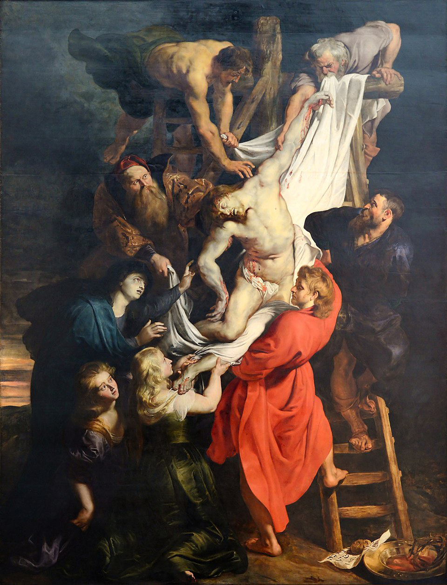

# Heinrich Schutz(1585-1672)

Credit : Portrait of Schutz by Christoph Spatner, 1660, Public Domain, [Wikimedia Commons](https://commons.m.wikimedia.org/wiki/File:Schutz.jpg#file)

Heinrich Schutz was a German composer, and Schutz played a very important role in the beginning of German Baroque music. He had a profound influence on later German music and is considered a figure who successfully integrated new Italian musical techniques into German music. He fused innovative Italian musical styles, including madrigal techniques and word painting, with the German Lutheran religious music tradition to build his own unique style. In particular, he is sometimes called the 'Father of German Music,' having inspired Johann Sebastian Bach. He went to Venice, Italy for study twice. During his second study trip in 1628, he encountered the music of [Claudio Monteverdi](monteverdi_lincoronazione_di_poppea.md), who was already leading the new trend in Italian music, and was deeply influenced. As a result, he succeeded in successfully fusuing the Italian style into German religious music.

## :monocle_face: Why Heinrich Schutz?

When I was contemplating which composer to select, I became interested in Schutz upon seeing that most of his works are Protestant music. This is because, as a Christian myself, I became curious about how Schutz expressed 17th-century Protestant faith through his music. It is said that Schutz, a Lutheran, made significant contributions to the development of German Protestant music after the Reformation, particularly by composing oratorios, Passions, motets, and Bible stories based on German biblical texts.

## Table of Contents
- [Schutz in Historical Context](#schutz-in-historical-context)
- [Chronicle of Schutz](#chronicle-of-schutz)
- [List of Important Works](#list-of-important-works)
- [Excerpt from Schutz's Music](#excerpt-from-schutzs-music)
- [Listening Guide](#listening-guide)
- [Instruments Used During This Period](#instruments-used-during-this-period)
- [Artworks from This Period](#artworks-from-this-period)

## Learning Objects
- Understand Heinrich Schutz's contribution to the development of German Baroque music.
- Examine the influence of the religious and political context of 17th-century Germany on Schutz's music.

## Schutz in Historical Context
:mag_right: ***Heinrich Schutz: A Key Figure in 17th-Century German Baroque Music, Father of German Music***

**Heinrich Schutz** stands as a towering figure in **early German Baroque music**. More than just a composer, Schutz served as a crucial conduit for the influx of innovative Italian musical currents into Germany, profoundly shaping the trajectory of the German musical heritage. He masterfully synthesized the expressive new style from Italy with the established traditions of **German Lutheran church music**.

Born in the wake of **the Reformation** and during the era following the destructive **Thirty Years' War** (1618-1648), a period of considerable religious and political upheaval, Schutz's life and career were inextricably linked to these turbulent times, yet simultaneously vibrant with artistic innovation. The war, in particular, deeply impacted the resources available for musical performance, often necessitating Schutz to compose for smaller ensembles. However, these adversities did not stifle his creativity; they may have even sharpened his focus on conveying deep emotional and spiritual meaning through music. Schutz's genius lay in his masterful synthesis of the rich, expressive new musical styles from Italy with the established traditions of **German Lutheran church music**, which profoundly shaped the course of German music for generations, most notably influencing later masters like **Johann Sebastian Bach**.
By skillfully integrating Italian innovations—the *concertato* principle, madrigalisms, monody, and dramatic *recitativo*—with the German language and the devout spirit of Lutheranism, Heinrich Schutz forged a unique and powerful musical language. He not only laid the groundwork for the flourishing of Baroque music in Germany but also created **works of profound personal and lasting significance that eloquently expressed the Protestant faith in the 17th century**. His dedication to setting German biblical texts with deep understanding and emotional resonance solidified his place as a foundational composer in the history of sacred music.

Schutz made the scriptures accessible and emotionally resonant to congregations through his commitment to setting **German biblical texts**. His oratorios, Passions, motets (such as his *Cantiones sacrae* of 1625, which exhibit a more intense and personal expression), and settings of biblical narratives were not mere musical exercises; they were deeply personal and communal declarations of faith. In a time marked by religious conflict and widespread suffering, Schutz's music offered solace, spiritual depth, and a powerful affirmation of the core tenets of the Protestant tradition, cementing his role as a foundational figure in the rich history of German **sacred music**. [[Back to TOC]](#table-of-contents)

## Chronicle of Schutz

| Year      | Major Events                                                                                                                    |
| :-------: | ------------------------------------------------------------------------------------------------------------------------------- |
| 1585      | Born in Köstritz, Germany, on October 8.                                                                                        |
| 1599      | Became a choirboy in the court chapel of Landgrave Moritz von Hessen-Kassel.                                                    |
| 1609      | Traveled to Venice, Italy, to study under Giovanni Gabrieli.                                                                    |
| 1612      | Returned to Germany after Gabrieli's death.                                                                                     |
| 1614      | Appointed court organist in Kassel.                                                                                             |
| 1615      | Appointed Kapellmeister to Elector Johann Georg I at the Dresden court. (Held this position until his death)                    |
| 1618-1648 | The Thirty Years' War occurred. Faced many difficulties in musical activities during this period.                               |
| 1628      | Second trip to Italy (Venice). Deeply influenced by Claudio Monteverdi.                                                         |
| 1629      | Published 《Symphoniae Sacrae, Part 1》.                                                                                         |
| 1635      | Published 《Musikalische Exequien (Musical Funeral Rites)》.                                                                     |
| 1648      | The Thirty Years' War concluded.                                                                                                |
| 1664      | Composed 《Historia der Geburt Christi (The Christmas Story)》.                                                                  |
| 1666      | Composed 《Matthäus-Passion (St. Matthew Passion)》 and 《Johannes Passion (St. John Passion)》.                                  |
| 1672      | Died in Dresden on November 6, at the age of 87. | 

[[Back to TOC]](#table-of-contents)

## List of Important Works 

| Year | Works                                    | YouTube                                                    |
| ---- | ---------------------------------------- | ---------------------------------------------------------- |
| 1629 | Symphoniae Sacrae, Op.6, SWV 257-276     | [Listen](https://youtu.be/SqFzrpLFIaU?si=UKlBCj_UZmMoUZEO) |
| 1635 | Musikalische Exequien, Op.7, SWV 279-281 | [Listen](https://youtu.be/-txG7o-ikt4?si=gQtpYnHdb6w30RhC) |
| 1664 | Historia der Geburt Christi, SWV 435     | [Listen](https://youtu.be/b30GOw_tbpU?si=WLy2uj6K74f240eZ) |
| 1666 | Matthäus-Passion, SWV 479                | [Listen](https://youtu.be/w__eUcyHXwU?si=ut2xSdXycLkvdHfv) |
| 1666 | Johannes Passion, SWV 481                | [Listen](https://youtu.be/dptgsKRqOfc?si=Sd_reUYxY3ZYRUGU) | 

[[Back to TOC]](#table-of-contents)

## Excerpt from Schutz's Music 

[:headphones:](https://youtu.be/w__eUcyHXwU?si=ut2xSdXycLkvdHfv)

*St. Matthew Passion* is one of Schutz's late masterpieces, depicting **the Passion story of Jesus Christ**. A notable characteristic of this work is that it is performed solely by vocal ensembles without any instrumental accompaniment. Schutz composed this piece while working as the Kapellmeister at the Dresden court. During that time, Germany was facing a difficult period due to the aftermath of the Thirty Years' War (1618-1648). In the context of restricted musical activities, Schutz's Passion oratorios played a crucial role in maintaining the tradition of religious music. [[Back to TOC]](#table-of-contents)

> ### Listening Guide
>
> :point_up: When listening to this piece, focus on the following three aspects.
> 
> 1. **The 'Passion' as Storytelling**
> - Role of the Evangelist: Follow the Evangelist's voice and concentrate on how the biblical story unfolds. It's important to perceive how changes in his vocal tone or the flow of the melody express the tension and emotions of the narrative.
> - Dialogue of the Characters: The lines of other characters, such as Jesus, Pilate, and Peter, are expressed by parts of the choir or by solo singers. Since each character's dialogue is presented briefly and clearly, it's enjoyable to distinguish who is saying what.
> 2. **The Versatility of A Cappella Choirs**
> - Crowd Choirs (Turbae): The voices of the crowd, mocking Jesus or shouting "Crucify him!", are depicted with great dynamism and intensity. Imagine the crowd psychology and atmosphere of the time as you listen. Schütz maximizes the dramatic effect in these sections through changes in tempo and dynamics.
> - Choral work filled with inner reflection: The chorus, appearing at significant turning points or emotional moments in the story, goes beyond simple narration and induces inner reflection in the audience. In this part, focus on the harmony of chords and timbre of the choir, and feel the reverent and contemplative atmosphere that the work intends to convey.
> 3. **The Aesthetics of Silence and Space**
> - The Meaning of Empty Space: The absence of instrumental accompaniment sometimes creates moments of 'silence,' where there is no sound. Pay attention to whether this silence makes the subsequent sound more impressive, or adds weight to the emotions of the characters or the dramatic situation.
> - The Beauty of the Voice Itself: Music composed solely of human voices maximizes the independent movement of each part and the beauty of the pure harmony it creates. Focus on how the voices of each part blend and separate to feel the texture of sound that Schütz intended. [[Back to TOC]](#table-of-contents)

## Instruments Used During This Period 

 

Credit : An image of <ins>viola da gamba</ins> created by Gemini 25 pro, Jun 6, 2025, 21:52:23 PM, with the prompt "Create an image of viola da gamba used during the period of Heinrich Schütz(1585-1672)."

Credit : An image of <ins>harpsichord</ins> created by Gemini 25 pro, Jun 6, 2025, 21:58:51 PM, with the prompt "Create an image of harpsichord used during the period of Heinrich Schütz(1585-1672)." [[Back to TOC]](#table-of-contents)

## Artworks from This Period

Credit : *The Descent from the Cross* by Peter Paul Rubens, 1614, Public Domain, [Wikimedia Commons](https://commons.m.wikimedia.org/wiki/File:Descent_from_the_Cross_(Rubens)_July_2015-1a.jpg#mw-jump-to-license)

Explanation : It is known that this work was commissioned and created by Rubens after he returned from a long stay in Italy. The painting dramatically depicts **the scene of Jesus's body being taken down from the cross** and evokes an atmosphere of intense sorrow. This sorrow is particularly prominent in the depiction of Jesus's mother Mary (the figure in blue), desperately reaching out to touch her son, which clearly demonstrates a characteristic of Baroque art that **aims to evoke emotional states in a dramatic manner**. [[Back to TOC]](#table-of-contents)
