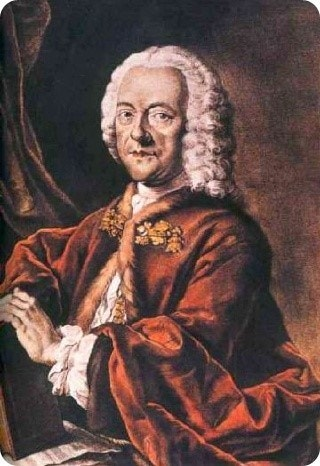

# Georg Philipp Telemann (1681~1767)

German composer **Georg Philipp Telemann**(1681~1767) was a German Baroque composer. He is one of the most prolific composer in history. His music incorporates French, Italian, and German national styles, and he was at times even influenced by Polish popular music. He remained at the forefront of all new musical tendencies, and his music stands as an important link between the late Baroque and early Classical styles.

### Timeline of Georg Philipp Telemann

| Year | timeline | 
| ---- | ----- |
| 1681 | Born in Magdeburg |
| 1701 | Entrance to Lepzig University as a law major|
| 1705 | Became Kapellmeister(Court Music Director) at the court of Count Erdmann II. |
| 1707 | Travel to Paris |
| 1708 | Became Kapellmeister at the court of Eisenach |
| 1721~1767 | Music director of the five main churches of Hamburg |
| 1767 | Died in Hamburg, Germany |

## Sonata for Bassoon in f minor, TWV 41:f1

Background of the work

Telemann’s Bassoon Sonata in F Minor is a work composed in the early 18th century by Georg Philipp Telemann for bassoon and continuo. Although the exact date of composition and any formal dedication are unknown, the piece is considered a strong example of Telemann’s chamber music style. At the time, the bassoon was primarily used in orchestras or as a continuo instrument, but this sonata treats the bassoon as a lyrical and expressive solo voice, expanding its role and showcasing its potential. The key of F minor conveys melancholy and introspection, with flowing melodies and descending lines that reflect the emotional depth characteristic of Baroque expression.

| Element        | Description                                                                                                           |
| -------------- | --------------------------------------------------------------------------------------------------------------------- |
| **Genre**      | Baroque solo sonata for bassoon and continuo                                                                          |
| **Dedication** | None (no known official dedication)                                                                                   |
| **Style**      | Elegant and expressive Baroque style; features structured counterpoint, lyrical lines, and emotive descending figures |
| **Symbolism**  | The key of F minor conveys sorrow and introspection; slow movements highlight emotional depth                         |
| **Importance** | One of the earliest and most significant solo works for bassoon, showcasing the instrument’s expressive potential     |

### List of important works

| Year      | Works                                                    | YouTube |
| ----------| ---------------------------------------------------------| ------- |
| 1728~1729 | Sonata for Bassoon in f minor, TWV 41:f1                 | [Listen](https://youtu.be/k1ag_HJUkKQ?si=ATjBxKCfA9lEak31) |
| 1712~1721 | Concerto for Flute&Recorder&Strings in e minor, TWV 52:e1| [Listen](https://youtu.be/0YSXpzuv8GU?si=lAaX3AFsbEQMkRfC) |
| 1720~1721 | Concerto in G Major for Two Violas and String Orchestra, TWV 52:G3| [Listen](https://youtu.be/itzAV8tjRBk?si=b-CcxuAizQg2MRVJ) |
| unknown | Concerto in D Major for Violin, Cello, Trumpet, String and B.C, TWV 53:D5| [Listen](https://youtu.be/e3vtyS0Vn4s?si=d7YB4L-kYDdbnH6Mhttps://youtu.be/e3vtyS0Vn4s?si=d7YB4L-kYDdbnH6M)|
| unknown | Concerto for Two Horns in D Major TWV 52:D2| [Listen](https://youtu.be/ktvIIxtFRpM?si=yaUSE6xULch1pvFs)

**Baroque music** holds a central place in the history of Western music because it marks the emergence of many foundational elements that continue to shape musical language today. During this period, the tonal system based on major and minor keys became fully established, replacing the modal systems of the Renaissance. This shift allowed for a more structured and expressive harmonic vocabulary, which in turn enabled composers to explore new depths of emotional contrast and formal organization. The Baroque era also witnessed the rise of instrumental music as an autonomous art form. Composers such as J.S. Bach, Antonio Vivaldi, and G.P. Telemann developed idiomatic writing for instruments, showcasing their technical capabilities and timbral character in solo sonatas, concertos, and ensemble works. These innovations were supported by the growing standardization of musical forms like the fugue, suite, sonata, and ritornello-based concerto.

